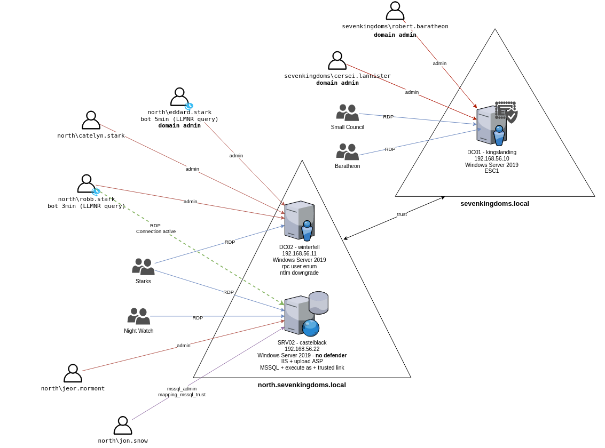

  
# Introducción  
  
El proyecto GOAD es un proyecto para la automatización y creación de entornos de Active Directory especialmente vulnerables pensado para proporcionar a los pentesters un entorno listo para poner en práctica diversas técnicas de ataque.  
  
Aprovechando este escenario vulnerable, este documento pretende ser una guía de recomendaciones de bastionado en entornos de Directorio Activo. Para ello su utilizará el entorno de laboratorio [GOAD-Light](https://github.com/Orange-Cyberdefense/GOAD/blob/main/ad/GOAD-Light/README.md) , basado en el proyecto [GOAD](https://github.com/Orange-Cyberdefense/GOAD/tree/main) y se aplicarán medidas destinadas a mitigar vulenrabilidades y errores de bastionado en el controlador de dominio **DC01-Kingslanding**.  
# Descripción del entorno   
El diagrama lógico del entorno es el siguiente:  
  
  
  
### Servidores  
  
Este laboratorio se compone de tres máquinas virtuales:  
  
- **kingslanding**: DC01 ejecutando en Windows Server 2019 (con Windows Defender habilitado por defecto). ==Este será el servidor en el que aplicaremos las recomendaciones de bastionado.==  
- **invernalfell**: DC02 se ejecuta en Windows Server 2019 (con Windows Defender habilitado por defecto)  
- **castelblack**: SRV02 que se ejecuta en Windows Server 2019 (con Windows Defender **deshabilitado** por defecto)  
#### Dominio : north.sevenkingdoms.local  
- **winterfell** : DC02  
- **castelblack** : SRV02 : MSSQL / IIS  
#### Dominio : sevenkingdoms.local  
- **kingslanding** : DC01  
  
### Usuarios/Grupos y vulnerabilidades asociadas a los escenarios  
  
#### north.sevenkingdoms.local  
- Grupo **stark**: RDP en **winterfell** y **castelblack**  
	- Usuarios:  
	    - *arya.stark*: Execute as user on mssql  
	    - *eddard.stark*: DOMAIN ADMIN NORTH/ (bot 5min) LLMRN request to do NTLM relay with responder  
	    - *catelyn.stark*  
	    - *robb.stark*: bot (3min) RESPONDER LLMR  
	    - *sansa.stark*  
	    - *brandon.stark*: ASREP_ROASTING  
	    - *rickon.stark:*  
	    - *theon.greyjoy:*  
	    - *jon.snow:* mssql admin / KERBEROASTING / group cross domain / mssql trusted link  
	    - *hodor:* PASSWORD SPRAY (user=password)  
- Grupo **night watch**: RDP en **castelblack**  
    - *samwell.tarly:* Password en la descripción de ldap / mssql execute as login GPO abuse (Edit Settings on "STARKWALLPAPER" GPO)  
    - *jon.snow:* (see starks)  
    - *jeor.mormont:* (see mormont)  
- Grupo **mormont**: RDP en **castelblack**  
    - *jeor.mormont*: ACL writedacl-writeowner on group **Night Watch**  
- Grupo **AcrossTheSea** : cross forest group  
  
#### sevenkingdoms.local  
- Grupo **lanisters**  
    - *tywin.lannister*: ACL forcechangepassword on *jaime.lanister*  
    - *jaime.lannister*: ACL genericwrite-on-user *joffrey.baratheon*  
    - *tyron.lannister*: ACL self-self-membership-on-group **Small Council**  
    - *cersei.lannister*: DOMAIN ADMIN **sevenkingdoms**  
- Grupo **baratheon**: RDP on kingslanding  
    - *robert.baratheon*: DOMAIN ADMIN **sevenkingdoms**  
    - *joffrey.baratheon*: ACL Write DACL on *tyron.lannister*  
    - *renly.baratheon*:  
    - *stannis.baratheon*: ACL genericall-on-computer **kingslanding** / ACL writeproperty-self-membership **Domain Admins**  
- Grupo **small council** : ACL add Member to group **dragon stone** / RDP on **kingslanding**  
    - *petyer.baelish*: ACL writeproperty-on-group **Domain Admins**  
    - *lord.varys*: ACL genericall-on-group **Domain Admins** / **Acrossthenarrossea**  
    - *maester.pycelle*: ACL write owner on group **Domain Admins**  
- Grupo **dragonstone** : ACL Write Owner on kingsguard  
- Grupo **kingsguard** : ACL generic all on user *stannis.baratheon*  
- *AccorsTheNarrowSea*: cross forest group  
  
### Permisos de usuarios y grupos locales  
  
#### sevenkingdoms.local  
-  **DC01** : **kingslanding.sevenkingdoms.local** (Windows Server 2019) (sevenkingdoms DC)  
    - Admins : *robert.baratheon* (U), *cersei.lannister* (U)  
    - RDP: **Small Council** (G)  
#### north.sevenkingdoms.local      
-  **DC02** : **winterfell.north.sevenkingdoms.local** (Windows Server 2019) (NORTH DC)  
	- Admins : *eddard.stark* (U), *catelyn.stark* (U), *robb.stark* (U)  
	- RDP: **Stark**(G)  
- **SRV02** : **castelblack.essos.local** (Windows Server 2019) (IIS, MSSQL, SMB share)  
     - Admins: *jeor.mormont* (U)  
     - RDP: **Night Watch** (G), **Mormont** (G), **Stark** (G)  
     - IIS : allow asp upload, run as NT Authority/network  
     - MSSQL:  
	     - admin : *jon.snow*  
	     - impersonate :  
		     - execute as login : *samwel.tarlly* -> sa  
		     - execute as user : *arya.stark* -> dbo   
  
# Explotación del escenario  
  
El escenario desplegado en [GOAD-Light](https://github.com/Orange-Cyberdefense/GOAD/blob/main/ad/GOAD-Light/README.md) permite la utilización exitosa de las siguientes vulnerabilidades,  errores de bastionado, así como de diferentes técnicas de red teaming. La clasificación se basa en la naturaleza de cada elemento: las vulnerabilidades se refieren a defectos de seguridad identificables, los errores de bastionado son prácticas o configuraciones inseguras, y las técnicas de red teaming son métodos utilizados en pruebas de penetración o simulaciones de ataque.  
## Vulnerabilidades  
  
El escenario presenta varias vulnerabilidades asociadas a diferentes CVEs que pueden ser explotadas para diferentes objetivos. Entre ellas:  
### Zerologon  
  
- **CVE asociados**: CVE-2020-1472  
- **Descripción**: Vulnerabilidad crítica en el protocolo Netlogon de Windows. Permite a un atacante no autenticado comprometer el controlador de dominio de Windows y potencialmente tomar el control de toda la red de Windows.  
- **TTPs MITRE**:  
  - Tactic: Privilege Escalation, Credential Access  
  - Technique: T1068 - Exploitation for Privilege Escalation, T1003 - OS Credential Dumping.   
  - [Link MITRE](https://attack.mitre.org/techniques/T1068/)  
  
### PrintNightmare  
  
- **CVE asociado**: CVE-2021-34527  
- **Descripción**: Vulnerabilidad en el servicio Windows Print Spooler. Permite a los atacantes ejecutar código remoto con privilegios de sistema y realizar acciones como instalar programas, modificar datos y crear nuevas cuentas con derechos de usuario completos.  
- **TTPs MITRE**:  
  - Tactic: Privilege Escalation, Execution  
  - Technique: T1068 - Exploitation for Privilege Escalation, T1204 - User Execution.   
  - [Link MITRE](https://attack.mitre.org/techniques/T1068/)  
- **Ejemplo de uso en el escenario**: [Enlace](https://mayfly277.github.io/posts/GOADv2-pwning-part5/#printnightmare)  
  
### sAMAccountName Spoofing  
  
- **CVEs asociados**: CVE-2021-42278, CVE-2021-42287  
- **Descripción**: sAMAccountName spoofing está relacionada con varias vulnerabilidades que permiten la suplantación del nombre de cuenta de seguridad (sAMAccountName) en entornos de Active Directory. Esta técnica puede ser utilizada para ataques de elevación de privilegios o para engañar a los sistemas de seguridad y auditoría.  
- **TTPs MITRE**:  
  - Tactic: Defense Evasion, Credential Access  
  - Technique: T1036 - Masquerading, T1078 - Valid Accounts.   
  - [Link MITRE](https://attack.mitre.org/techniques/T1036/)  
- **Ejemplo de uso en el escenario**: [Enlace](https://mayfly277.github.io/posts/GOADv2-pwning-part5/#samaccountname-nopac)  
### Petitpotam unauthent  
  
- **CVE asociado**: CVE-2021-36942  
- **Descripción**: Es una vulnerabilidad que permite a un usuario unido a un dominio escalar sus privilegios. Un usuario de dominio que crea una cuenta de computador obtiene los permisos de escritura validada en el nombre de host DNS y de escritura validada en el nombre principal del servicio (entre otros derechos). Por lo tanto, el usuario puede cambiar los atributos del nombre de host DNS (dNSHostName) y SPN (servicePrincipalName) de la cuenta del computador.Las cuentas de computadora (que usan la plantilla Máquina) usan el valor de la propiedad dNSHostName para la autenticación. Intentar cambiar el dNSHostName para que coincida con otra cuenta de computadora genera un error de restricción. De hecho, en el momento en que se edita la propiedad dNSHostName, el controlador de dominio se asegura de actualizar los SPN existentes de la cuenta para que la parte "nombre de host" se actualice al nuevo nombre de host DNS. Si los SPN ya existen para otra cuenta en Active Directory, los controladores de dominio generan la infracción de la restricción.  
- **TTPs MITRE**:  
  - Tactic: Credential Access, Lateral Movement  
  - Technique: T1557 - Man-in-the-Middle, T1075 - Pass the Ticket / Pass the Hash.  
  - [Link MITRE T1557](https://attack.mitre.org/techniques/T1557/), [Link MITRE T1075](https://attack.mitre.org/techniques/T1075/)  
- **Ejemplo de uso en el escenario**: [Enlace](https://mayfly277.github.io/posts/GOADv2-pwning-part6/#esc8---coerce-to-domain-admin)  
  
### Certifried  
  
- **CVE asociado**:  CVE-2022-26923  
- **Descripción**: “Certifried” es una vulnerabilidad en AD CS que permite a un usuario de dominio elevar sus privilegios. Un usuario de dominio que crea una cuenta de ordenador obtiene los permisos de “Validated write to DNS host name” y “Validated write to service principal name”. Por lo tanto, el usuario puede cambiar los atributos de nombre de host DNS (dNSHostName) y SPN (servicePrincipalName) de la cuenta de ordenador. La vulnerabilidad permite limpiar los SPN, cambiar el dNSHostName al nombre de host DNS del objetivo (no se producirá una violación de restricción ya que no habrá ningún SPN para actualizar), y luego solicitar un certificado para la cuenta de ordenador. Con el certificado obtenido, se puede autenticar como el Controlador de Dominio.  
 - **TTPs MITRE**:      
    - Tactic: Credential Access, Lateral Movement  
    - Technique: T1558 - Steal or Forge Kerberos Tickets.  
    - [Link MITRE T1558](https://attack.mitre.org/techniques/T1558/)  
- **Ejemplo de uso en el escenario**: [Enlace](https://mayfly277.github.io/posts/GOADv2-pwning-part6/#certifried---cve-202226923)  
  
## Errores de bastionado  
  
El escenario desplegado presenta los siguientes errores de configuración y bastionado:  
### Password reuse between computers  
  
- **Descripción**: Se refiere al uso de la misma contraseña en diferentes sistemas o dispositivos, lo que aumenta el riesgo de acceso no autorizado en caso de que una cuenta sea comprometida, facilitando la escalada de privilegios o el acceso lateral dentro de una red sin necesidad de técnicas como Pass the Hash.  
- **TTPs MITRE**:  
  - Tactic: Credential Access  
  - Technique: T1078 - Valid Accounts.  
  - [Link MITRE T1078](https://attack.mitre.org/techniques/T1078/)  
  
### Password in description  
  
- **Descripción**: Se refiere al almacenamiento de contraseñas en el campo de descripción de cuentas o en documentación accesible, lo que facilita el acceso no autorizado sin necesidad de técnicas de fuerza bruta o ingeniería social.  
- **TTPs MITRE**:  
  - Tactic: Credential Access  
  - Technique: T1552 - Unsecured Credentials.  
  - [Link MITRE T1552](https://attack.mitre.org/techniques/T1552/)  
  
### SMB share anonymous  
  
- **Descripción**: Se refiere a la configurar de recursos compartidos mediante SMB (Server Message Block) que permiten acceso anónimo lo que puede exponer archivos y directorios a cualquier usuario de la red, comprometiendo la seguridad de los datos, pudiendo ser explotado para obtener información sensible o para la propagación de malware.  
- **TTPs MITRE**:  
  - Tactic: Lateral Movement, Discovery  
  - Technique: T1046 - Network Service Scanning, T1083 - File and Directory Discovery.  
  - [Link MITRE T1046](https://attack.mitre.org/techniques/T1046/), [Link MITRE T1083](https://attack.mitre.org/techniques/T1083/)  
  
### SMB not signed  
  
- **Descripción**: Se refiere al envío de paquetes SMB sin estar firmados digitalmente lo que puede  permitir ataques de MITM, donde los atacantes pueden interceptar y manipular el tráfico SMB, comprometiendo la integridad y confidencialidad de los datos transmitidos.  
- **TTPs MITRE**:  
  - Tactic: Credential Access, Collection  
  - Technique: T1557 - Man-in-the-Middle.  
  - [Link MITRE T1557](https://attack.mitre.org/techniques/T1557/)  
  
### MSSQL trusted link  
  
- **Descripción**: En el contexto de Microsoft SQL Server (MSSQL), el término "Trusted Link" se refiere a la configuración de enlaces de confianza entre diferentes servidores SQL. Esta configuración permite que un servidor SQL confíe en otro para autenticar a los usuarios y ejecutar consultas en su nombre. Esto puede ser aprovechado por atacantes para realizar acciones no autorizadas en el servidor de destino a través del servidor vinculado.-   
- **TTPs MITRE**:  
  - Tactic: Privilege Escalation, Execution  
  - Technique: T1554 - Compromise Client Software Binary.  
  - [Link MITRE T1554](https://attack.mitre.org/techniques/T1554/)  
  
### MSSQL impersonate  
  
- **Descripción**: La capacidad de suplantación (impersonate) en MSSQL permite a un usuario ejecutar comandos bajo el contexto de otro usuario, lo que podría permitir la elevación de privilegios si se suplanta a un usuario con más permisos.  
- **TTPs MITRE**:  
  - Tactic: Privilege Escalation, Defense Evasion  
  - Technique: T1556 - Modify Authentication Process.  
  - [Link MITRE T1556](https://attack.mitre.org/techniques/T1556/)  
  
### Insecure IIS Configuration  
  
- **Descripción**: Una configuración insegura de IIS (Internet Information Services) puede exponer el servidor web a varios ataques. Esto incluye permisos excesivos, autenticación débil, y exposición de información sensible a través de mensajes de error detallados o directorios no protegidos.  
- **TTPs MITRE**:  
  - Tactic: Initial Access, Discovery  
  - Technique: T1190 - Exploit Public-Facing Application, T1083 - File and Directory Discovery.  
  - [Link MITRE T1190](https://attack.mitre.org/techniques/T1190/)  
  - [Link MITRE T1083](https://attack.mitre.org/techniques/T1083/)  
- **Ejemplo de uso en el escenario**: [Enlace](https://mayfly277.github.io/posts/GOADv2-pwning-part8/)  
  
  
-----  
## Técnicas de Red Teaming  
  
El escenario es vulnerable a las siguientes estrategias de red teaming:  
### Kerberoasting  
  
- **Descripción**: Kerberoasting es una técnica de ataque que explota la función de Kerberos en Windows para robar hashes de tickets de servicio que luego pueden ser crackeados fuera de línea para descubrir contraseñas de cuentas de servicio. No se basa en fallas de Kerberos, sino en el mal uso o configuraciones débiles de las contraseñas de las cuentas de servicio.  
- **TTPs MITRE**:  
  - Tactic: Credential Access  
  - Technique: T1558.003 - Kerberoasting.  
  - [Link MITRE T1558.003](https://attack.mitre.org/techniques/T1558/003/)  
- **Ejemplo de uso en el escenario**: [Enlace](https://mayfly277.github.io/posts/GOADv2-pwning-part3/#kerberoasting)  
  
### ASREPRoast  
  
- **Descripción**: ASREPRoast es una técnica de ataque que explota configuraciones inseguras en cuentas de Active Directory que no requieren preautenticación Kerberos. Permite a un atacante solicitar datos de autenticación para cualquier usuario que tenga la preautenticación deshabilitada y luego intentar crackear esos datos fuera de línea para descubrir contraseñas.  
- **TTPs MITRE**:  
  - Tactic: Credential Access  
  - Technique: T1558.004 - ASREPRoast.  
  - [Link MITRE T1558.004](https://attack.mitre.org/techniques/T1558/004/)  
- **Ejemplo de uso en el escenario**: [Enlace](https://mayfly277.github.io/posts/GOADv2-pwning-part2/#asrep---roasting)  
  
### Password Spray  
  
- **Descripción**: Password Spray es una técnica de ataque en la que se prueban contraseñas comunes contra múltiples cuentas de usuario para evitar bloqueos por intentos fallidos de autenticación. Se basa en la probabilidad de que, en un conjunto grande de usuarios, al menos algunos utilicen contraseñas débiles y comunes.  
- **TTPs MITRE**:  
  - Tactic: Credential Access  
  - Technique: T1110.003 - Password Spraying.  
  - [Link MITRE T1110.003](https://attack.mitre.org/techniques/T1110/003/)  
- **Ejemplo de uso en el escenario**: [Enlace](https://mayfly277.github.io/posts/GOADv2-pwning-part2/#password-spray)  
  
### NTLM Relay  
  
- **Descripción**: NTLM Relay es una técnica de ataque en la que un atacante intercepta la autenticación NTLM y la retransmite a otro servidor. Esto permite al atacante autenticarse en un sistema o servicio remoto sin conocer la contraseña del usuario, explotando la forma en que NTLM maneja la autenticación.  
- **TTPs MITRE**:  
  - Tactic: Credential Access, Lateral Movement  
  - Technique: T1557.001 - LLMNR/NBT-NS Poisoning and SMB Relay.  
  - [Link MITRE T1557.001](https://attack.mitre.org/techniques/T1557/001/)  
- **Ejemplo de uso en el escenario**: [Enlace](https://mayfly277.github.io/posts/GOADv2-pwning-part4/#ntlm-relay)  
  
### Pass The Hash  
  
- **Descripción**: Pass The Hash (PtH) es una técnica de ataque en la que un adversario captura un hash de contraseña y lo utiliza para autenticarse y obtener acceso lateral a otros sistemas en la red. Con esta técnica, el actor de la amenaza no necesita descifrar el hash para obtener una contraseña en texto plano. En un ataque de Pass the Hash, el atacante comienza obteniendo acceso al hash de un usuario, a menudo volcando el contenido de la base de datos SAM del sistema o de la memoria, utilizando herramientas como Mimikatz.  
- **TTPs MITRE**:  
  - Tactic: Credential Access, Lateral Movement  
  - Technique: T1550.002 - Pass the Hash.  
  - [Link MITRE T1550.002](https://attack.mitre.org/techniques/T1550/002/)  
- **Ejemplo de uso en el escenario**: [Enlace](https://mayfly277.github.io/posts/GOADv2-pwning-part9/#password-reuse-and-pth-attack)  
  
### Constrained Delegation  
  
- **Descripción**: Constrained Delegation es una técnica de ataque que permite a un adversario abusar de la delegación limitada en Kerberos para elevar sus privilegios. En esta técnica, un adversario que ha comprometido una cuenta que tiene configurada la delegación limitada puede suplantar a cualquier usuario para acceder a servicios específicos listados en la lista de delegación permitida. Esto se logra explotando cómo Kerberos maneja la autenticación y la delegación. Un ejemplo de esto sería un servicio web que solo permite la delegación a servicios SQL.  
- **TTPs MITRE**:  
    - Tactic: Credential Access, Lateral Movement  
    - Technique: T1558 - Steal or Forge Kerberos Tickets.  
    - [Link MITRE T1558](https://attack.mitre.org/techniques/T1558/)  
- **Ejemplo de uso en el escenario**: [Enlace](https://mayfly277.github.io/posts/GOADv2-pwning-part10/#constrained-delegation)  
  
### Unconstrained Delegation  
  
- **Descripción**: Unconstrained Delegation es una técnica de ataque que permite a un adversario abusar de la delegación no restringida en Kerberos para elevar sus privilegios. Cuando un usuario accede a un servidor con la delegación no restringida habilitada, el usuario envía su TGT al servidor. El servidor puede entonces suplantar al usuario utilizando el TGT del usuario para autenticarse en otros servicios de la red. Los atacantes pueden robar esta información en caché a través de técnicas de acceso a credenciales. Los atacantes pueden avanzar en sus ataques contra la delegación no restringida utilizando comandos de PowerShell y Mimikatz. Pueden volcar y reutilizar las credenciales de LSASS, exportar todos los certificados privados y escalar privilegios para tener derechos de depuración en el ordenador remoto.  
- **TTPs MITRE**:  
    - Tactic: Credential Access, Lateral Movement  
    - Technique: T1558 - Steal or Forge Kerberos Tickets.  
    - [Link MITRE T1558](https://attack.mitre.org/techniques/T1558/)    -   
- **Ejemplo de uso en el escenario**: [Enlace](https://mayfly277.github.io/posts/GOADv2-pwning-part10/#unconstrained-delegation)  
  
### Cached Domain Logon Information  
  
- **Descripción**: Cached Domain Logon Information es una técnica de ataque que explota la funcionalidad de Windows de almacenar en caché las credenciales de dominio para permitir la autenticación en caso de que un controlador de dominio no esté disponible. Un adversario que puede acceder al sistema de archivos del servidor con privilegios elevados, puede localizar esta información en los Hives de registro adecuados y usar un ataque de fuerza bruta para determinar las contraseñas de los usuarios.   
- **TTPs MITRE**:  
    - Tactic: Credential Access  
    - Technique: T1003.005 - Cached Domain Credentials.  
    - [Link MITRE T1003.005](https://attack.mitre.org/techniques/T1003/005/)  
- **Ejemplo de uso en el escenario**: Aún no proporcionado.  
## Herramientas de pentesting  
  
Para llevar a cabo las estrategias anteriormente descritas o tratar de explotar alguna de las vulnerabilidades y errores mencionados anteriormente, se puede hacer uso de las siguientes herramientas de pentesting:  
### Mitm6  
  
- **Descripción**: mitm6 es una herramienta diseñada para explotar la configuración predeterminada de IPv6 en redes IPv4, realizando ataques man-in-the-middle (MitM). Aprovecha la manera en que los dispositivos buscan configuraciones de IPv6 para interceptar el tráfico y posiblemente obtener credenciales o datos sensibles.  
- **TTPs MITRE**:  
  - Tactic: Credential Access, Collection  
  - Technique: T1557 - Man-in-the-Middle.  
  - [Link MITRE T1557](https://attack.mitre.org/techniques/T1557/).  
- **Ejemplo de uso en el escenario**: [Enlace](https://mayfly277.github.io/posts/GOADv2-pwning-part4/#mitm6--ntlmrelayx-to-ldap)  
  
### Responder  
  
- **Descripción**: Responder es una herramienta que permite realizar ataques de envenenamiento LLMNR/NBT-NS y MitM para capturar hashes de contraseñas NTLM de la red. Está diseñada para escuchar en la red y responder a solicitudes de nombres de host que no están en el DNS, capturando así las credenciales de los usuarios que intentan acceder a recursos compartidos.  
- **TTPs MITRE**:  
  - Tactic: Credential Access  
  - Technique: T1557.001 - LLMNR/NBT-NS Poisoning and SMB Relay.  
  - [Link MITRE Software Responder](https://attack.mitre.org/software/S0174/)  
  
# Bastionado del sistema  
  
A continuación describiremos diversas medidas de securización y bastionado destinadas a mejorar la protección del entorno del directorio activo y reducir la superficie de ataque.  
  
Para evitar la duplicidad de las medidas adoptadas, centraremos las recomendaciones en uno solo de los servidores existentes, DC01-Kingslanding, teniendo en cuenta que, en un escenario real, tendríamos que adoptar medidas similares en los otros dos servidores existentes, aplicando además las medidas particulares que cada uno de ellos necesitara acorde a los diferentes roles que desempeñan.  
  
Antes de comenzar con la aplicación y descripción de las diferentes medidas a adoptar, vamos a realizar una primera valoración de la situación utilizando para ello algunas herramientas de auditoría y evaluación de seguridad.  
## Herramientas de auditoría y evaluación de seguridad  
  
Antes de comenzar con el proceso de bastionado del entorno, vamos a ejecutar algunas herramientas que nos van a permitir hacernos una idea del nivel de seguridad de nuestro entorno de Active Directory.  
  
Las herramientas que vamos a utilizar son:  
- **PingCastle**. Herramienta diseñada para la evaluación de riesgos, la auditoría de seguridad y la detección de vulnerabilidades dentro de entornos de Active Directory. Se enfoca en identificar configuraciones inseguras, prácticas de administración deficientes y otros riesgos potenciales que podrían ser explotados por atacantes.  
- **Purple Knight**. Es una herramienta de auditoría de seguridad similar a PingCastle desarrollada para entornos de Active Directory. Ofrece análisis y evaluaciones detalladas para identificar vulnerabilidades, configuraciones incorrectas, y prácticas de seguridad no óptimas que podrían comprometer la seguridad de la infraestructura de Active Directory.  
  
  
### Purple Knight  
  
Para la descarga de Purple Knight debemos de ir a la página [https://www.purple-knight.com/es/](https://www.purple-knight.com/es/) y, tras cubrir el formulario de descarga, recibiremos en el correo un enlace que nos permitirá descargar la herramienta.  
  
  
    
Purple Knight no necesita instalación, lo único que necesitamos será ejecutarla con permisos de administración en la máquina que queramos auditar.  
  
  
    
Una vez ejecutado, nos aparecerá un asistente que nos guiará en el proceso.  
  
  
    
Tras aceptar los términos de la licencia, nos solicitará el bosque o dominio sobre el cual queremos hacer el análisis:  
  
  
    
Seguidamente podemos seleccionar los test que queremos ejecutar sobre nuestro Directorio Activo:  
  
  
    
   
Finalmente, ejecutamos los test y esperamos por los resultados, que podemos visualizar directamente en un navegador web (_View Report_) o grabarlos en formato PDF o CSV (_Save As_). Por defecto se guardarán en la carpeta Output de Purple Knight.   
  
### PingCastle  
  
La descarga de PingCastle se hace desde el sitio web oficial ([https://www.pingcastle.com/download/](https://www.pingcastle.com/download/) ). Una vez descargado, lo ejecutaremos desde una consola de comandos con permisos de administrador.  
  
  
    
Nos aparecen varias opciones de ejecución pero la opción más habitual es la primera de ellas (Healthcheck) que nos proporciona un informe sobre la situación de varias configuraciones del sistema relativas a la seguridad del mismo.  
  
    
  
    
  
Una vez finalice, podemos acceder a los resultados, en formato HTML, en la propia carpeta de PingCastle.  
  
  
  
### Valoraciones obtenidas  
  
Vamos a ver las valoraciones de seguridad obtenidas por las dos herramientas en los tres equipos analizados  
#### Kingslanding (DC01) (dominio: sevenkingdoms.local)  
  
- **Purple Knight** (0 es el valor más negativo)  
  
  
- **Pingcastle** (100 es el valor más negativo)  
  
  
  
#### Winterfell (DC02) (dominio: north.sevenkingdoms.local)  
  
- **Purple Knight**  
  
  
  
- **Pingcastle**  
  
  
#### Castelblack (SRV02) (dominio: north.sevenkingdoms.local)  
  
- **Purple Kngiht**  
  
  
- **Pingcastle**  
  
  
  
Como podemos observar, la valoración obtenida por Purple Knight en los tres equipos es muy similar. Esto es debido a que realiza menos comprobaciones que Pingcastle y se centra en configuraciones a nivel de todo el bosque y no tanto en los equipos individuales. Vemos que para el caso de Pingcastle las valoraciones tienen más diferencias.  
  
En los siguientes apartados iremos aplicando diferentes medidas de bastionado e iremos comprobando si somos capaces de ir mejorando estas puntuaciones.  
  
## Actualizaciones automáticas (Windows Update)  
  
La primera medida de bastionado que vamos a aplicar es activar las actualizaciones automáticas en aquellos equipos que no las tienen configuradas y, seguidamente, aplicar los parches que estaban pendientes.   
Con esta medida eliminaremos, cuando menos, las vulnerabilidades siguientes existentes en el escenario:  
- Zerologon (CVE-2020-1472)  
- PrintNightmare (CVE-2021-34527)  
- sAMAccountName Spoofing (CVE-2021-42278, CVE-2021-42287)  
- Petitpotam unauthent (CVE-2021-36942)  
- Certifried (CVE-2022-26923)  
  
Los equipos que tienen desactivadas las actualizaciones automáticas son *Kingslanding(DC01)* y *Winterfell(DC02)*. Para activarlas iremos a *Servicios->Windows Update*. Pondremos la opción de Inicio en *Automático*  y le daremos a *Iniciar*.  
  
  
  
Seguidamente iremos a *Windows Update* y procederemos a la descarga e instalación de las actualizaciones pendientes.  
  
  
Finalmente, tendremos los equipos actualizados.  
  
  
Una vez comprobado que los tres equipos están actualizados, procedemos a volver a ejecutar los tests de Purple Knight y PingCastle en DC01 y DC02 que eran los equipos que no estaban actualizados.  
  
  
## Protección de las cuentas con privilegios elevados  
  
> [!NOTE] Nota.  
*Una organización debe convertir la protección del acceso con privilegios en la máxima prioridad de seguridad debido al importante impacto empresarial potencial (y alta probabilidad) de los atacantes que comprometen este nivel de acceso* ([Fuente](https://learn.microsoft.com/es-es/security/privileged-access-workstations/overview)).   
  
Los Administradores de dominio y los administradores locales del servidor serán nuestros usuarios privilegiados más evidentes. No obstante, puede ocurrir que, por diversas razones, tengamos más usuarios del dominio con permisos privilegiados y que no pertenezcan a estos dos grupos.  
### Forest Druid  
Para detectar los posibles usuarios privilegiados existentes en nuestro dominio vamos a utilizar *[Forest Druid](https://www.purple-knight.com/es/forest-druid/)* que nos permite rastrear aquellos objetos del dominio con mayores privilegios y que ellos denominan objetos "Tier 0".  
  
Forest Druid es una herramienta gratuita de descubrimiento de rutas de ataque, compatible de forma nativa con Active Directory que ayuda a priorizar rápidamente las configuraciones erróneas de alto riesgo que podrían representar oportunidades para que los atacantes obtengan acceso privilegiado al dominio mediante aquellos elementos más críticos y con mayores privilegios (activos **Tier 0**).  
  
##### Objetos de Nivel 0 (Tier 0)  
[Según Forest Druid](https://docs.purple-knight.com/community/forestdruid/fd-default-tier0-objects.htm?tocpath=Forest%20Druid%7CForest%20Druid%20User%20Guide%7C_____5) los objetos de nivel 0 en un entorno de directorio activo son:  
- **Contenedores**:  
	  - **Admin SD Holders**: Contiene objetos que están sujetos a restricciones de seguridad especiales para protegerlos de cambios no autorizados.      
- **Grupos**:  
    - **Account Operators**: Miembros de este grupo pueden administrar cuentas de usuario y grupos, pero no pueden modificar cuentas de administrador.  
    - **Administrators**: Los miembros de este grupo tienen control total sobre el dominio y pueden realizar cualquier tarea administrativa.  
    - **Backup Operators**: Los miembros pueden realizar copias de seguridad y restauraciones de datos en el dominio.  
    - **Cert Publishers**: Los miembros pueden publicar certificados en Active Directory para usuarios y equipos.  
    - **Certificate Service DCOM Access**: Los miembros tienen acceso a servicios de certificación a través de DCOM (Distributed Component Object Model).  
    - **Distributed COM Users**: Los miembros tienen acceso a aplicaciones DCOM en el dominio.  
    - **DnsAdmins**: Los miembros pueden administrar el servidor DNS del dominio.  
    - **Domain Administrators**: Los miembros tienen derechos de administrador en el dominio.  
    - **Domain Controllers**: Contiene todos los controladores de dominio del dominio.  
    - **Enterprise Administrators**: Los miembros tienen derechos de administrador en todos los dominios de un bosque.  
    - **Enterprise Key Admins**: Los miembros pueden administrar certificados de seguridad a nivel de empresa.  
    - **Enterprise Read-only Domain Controllers**: Contiene controladores de dominio de solo lectura de nivel empresarial.  
    - **Enterprise Domain Controllers**: Contiene controladores de dominio de nivel empresarial con acceso de lectura y escritura.  
    - **Group Policy Creator Owners**: Los miembros pueden crear y modificar objetos de directiva de grupo.  
    - **Incoming Forest Trust Builders**: Los miembros pueden establecer relaciones de confianza entrantes entre bosques.  
    - **Key Admins**: Los miembros pueden administrar certificados de seguridad a nivel de dominio.  
    - **Performance Log Users**: Los miembros pueden monitorear el rendimiento del sistema.  
    - **Print Operators**: Los miembros pueden administrar impresoras y colas de impresión en el dominio.  
    - **Read-only Domain Controllers**: Contiene controladores de dominio de solo lectura.  
    - **Remote Desktop Users**: Los miembros pueden acceder a equipos del dominio a través de Escritorio remoto.  
    - **Schema Admins**: Los miembros pueden realizar cambios en el esquema de Active Directory.  
    - **Server Operators**: Los miembros pueden administrar servidores del dominio pero no tienen derechos de administrador completos.      
- **Objetos**:  
    - **domainDNS (Partition Head)**: Objeto que representa un dominio en Active Directory y almacena información sobre el espacio de nombres del dominio.      
- **Usuarios**:  
	- **Administrator**: Cuenta de administrador predeterminada con derechos de administrador completos.  
    - **Krbtgt**: Cuenta de servicio utilizada por el servicio de autenticación Kerberos para emitir tickets.  
- **Roles**:  
	- **Application Administrator**: Proporciona administración de aplicaciones a nivel empresarial.  
	- **Authentication Administrator**: Tiene permisos para ver, establecer y restablecer información de métodos de autenticación para cualquier usuario que no sea administrador.  
	- **Authentication Policy Administrator**: Puede crear y administrar la política de métodos de autenticación, configuraciones de MFA en todo el inquilino, política de protección de contraseñas y credenciales verificables.  
	- **Billing Administrator**: Los administradores de facturación son responsables de administrar el proceso de facturación en su empresa u organización.  
	- **Cloud App Security Administrator**: Los usuarios con este rol tienen permisos completos de administración en Microsoft Cloud App Security (MCAS).  
	- **Cloud Application Administrator**: Los usuarios con este rol tienen los mismos permisos que el rol de Administrador de Aplicaciones, excluyendo la capacidad de administrar el proxy de la aplicación.  
	- **Conditional Access Administrator**: Los administradores con el rol de Administrador de Acceso Condicional pueden administrar políticas.  
	- **Directory Synchronization Accounts**: Este rol se utiliza para sincronizar información desde el Directorio Activo del servidor local (Windows Server AD) a Microsoft Entra ID.  
	- **Exchange Administrator**: Los administradores de Exchange son responsables de mantener la integridad del sistema de correo electrónico de una organización.  
	- **External Identity Administrator**: Los usuarios con este rol pueden configurar proveedores de identidad para su uso en la federación directa.  
	- **Global Administrator**: Los administradores globales tienen casi acceso ilimitado a la configuración de su organización y a la mayoría de sus datos.  
	- **Helpdesk Administrator**: Este rol generalmente tiene permisos para realizar tareas de soporte técnico, como restablecer contraseñas y verificar el estado de los servicios de Microsoft.  
	- **Password Administrator**: Este rol generalmente tiene permisos para restablecer contraseñas y ayudar a los usuarios a recuperar sus cuentas.  
	- **Privileged Authentication Administrator**: Este rol generalmente tiene permisos para administrar y configurar métodos de autenticación privilegiados.  
	- **Privileged Role Administrator**: Este rol generalmente tiene permisos para administrar y asignar roles privilegiados dentro de la organización.  
	- **SharePoint Administrator**: Este rol generalmente tiene permisos para administrar y configurar el entorno de SharePoint de la organización.  
	- **User Administrator**: Este rol generalmente tiene permisos para crear y administrar cuentas de usuario y grupos.  
- **Cuentas**:  
	- **Microsoft Graph**: Es una API que proporciona una interfaz unificada para muchos servicios de Microsoft, permitiendo a los desarrolladores y administradores acceder, manipular y combinar datos de una amplia gama de servicios de Microsoft, incluyendo Azure, Windows y Office 365.  
  
##### Descarga y ejecución  
Forest Druid se puede descargar desde la página [https://www.purple-knight.com/es/forest-druid/](https://www.purple-knight.com/es/forest-druid/).  
  
Tras cubrir el formulario con nuestros datos, podremos descargar un fichero zip que contiene la herramienta. La ejecución de la misma es tan sencilla como descomprimir el fichero y ejecutar el fichero **ForestDruid.exe**.  
  
El usuario que ejecuta Forest Druid debe tener permisos de lectura en Active Directory. Aunque no es necesario que el usuario sea Administrador de dominio, los usuarios con privilegios de Administrador de dominio podrán ver más información. **Forest Druid recopila datos de todos los dominios del bosque de Active Directory al que pertenece el dominio actual del usuario que ha iniciado sesión.**  
  
La herramienta al ejecutarse realizará un primer análisis identificando los activos Tier 0 y las posibles vías de ataque que presentan.  
  
##### Análisis de los resultados  
  
Una vez completada la recopilación inicial de datos, nos aparece a la derecha un resumen de los objetos encontrados y analizados. En este caso:  
  
  
Detrás de este resumen, la pantalla de resultados muestra los objetos predeterminados de nivel 0 en una lista a la izquierda y un gráfico de relaciones relaciones en 3D en la derecha. Esta lista y el gráfico de relaciones también muestran cualquier relación de acceso inmediato entre los objetos predeterminados de nivel 0 y otros objetos de Active Directory.  
    
  
    
Las relaciones de toma de control son tipos de relaciones que son "fuertes" en el sentido que permiten al propietario privilegiado controlar el objeto. Sabiendo esto, las relaciones de escalada de privilegios se darán cuando un objeto que no es de nivel 0 tiene una relación de toma de control con un objeto de nivel 0. Los resultados de la evaluación de Forest Druid revelan dónde los objetos de niveles inferiores tienen relaciones de escalada de privilegios con activos de nivel 0.  
  
**Lista de relaciones:**  
  
A continuación se presenta una descripción general de cada tipo de relación:  
- **AddSelf:** Permite que un usuario agregue su propia cuenta a un grupo.  
- **AddAllowedToAct:** Permite agregar una cuenta como controladora de seguridad en otra cuenta.   
- **AddMember (ExtendedRight):** Permite agregar miembros a un grupo.      
- **AddMemberToGmsaGroup (ExtendedRight):** Permite agregar miembros a un grupo de cuentas de servicio administrado por un grupo (gMSA).      
- **AllExtendedRights (ExtendedRight):** Concede todos los derechos extendidos a un usuario.      
- **AllowedToAct:** Indica que una cuenta puede actuar en nombre de otra cuenta.      
- **AllowedToDelegateTo:** Permite que un usuario delegue permisos a otro usuario o grupo.      
- **Contains:** Indica que un objeto está contenido dentro de otro objeto.      
- **ForceChangePassword (ExtendedRight):** Permite que un usuario fuerce el cambio de contraseña de otro usuario.      
- **GenericAll:** Concede a un usuario todos los permisos genéricos.      
- **GenericWrite:** Concede a un usuario permisos genéricos de escritura.      
- **GetChanges (ExtendedRight):** Permite a un usuario leer cambios en un objeto.      
- **GetChangesAll (ExtendedRight):** Permite a un usuario leer todos los cambios en un objeto.      
- **GpLink:** Indica que una política de grupo está vinculada a un objeto.      
- **GpLink Edit:** Permite la edición de un vínculo de política de grupo en un objeto.      
- **Member:** Indica que un usuario es miembro de un grupo.      
- **SidHistory:** Indica que un objeto tiene un historial de SID (Identificador de seguridad) que puede usarse para la escalada de privilegios.      
- **Owner:** Indica que un usuario es el propietario de un objeto.      
- **PrimaryGroup:** Indica que un usuario es miembro del grupo primario de un objeto. **ReadGMSAPassword:** Permite la lectura de contraseñas de cuentas de servicio administrado por un grupo (gMSA).      
- **ReadLAPSPassword:** Permite la lectura de contraseñas almacenadas en el servicio de contraseñas de administración local (LAPS).      
- **WriteDacl:** Permite la modificación de la lista de control de acceso discrecional (DACL) de un objeto.      
- **WriteOwner:** Permite la modificación del propietario de un objeto.      
- **WriteSPN:** Permite la modificación del Nombre principal de servicio (SPN) de un objeto.  
     
Desde esta lista y gráfico, se puede ver rápidamente cualquier relación de escalada de privilegios con activos de nivel 0. Los nodos coloreados en el gráfico y los iconos en la lista de objetos ayudan a diferenciar los objetos de nivel 0 de otros objetos de Active Directory:  
- Azul: Objetos de nivel 0 predeterminados.      
- Verde: Objetos de nivel 0 clasificados manualmente.      
- Naranja: Objetos de riesgo que guardan relación con los activos de nivel 0 **y que** **deben revisarse para determinar si deben clasificarse como objetos de nivel 0 o infringen el modelo de seguridad.**  
  
Vamos a centrarnos en aquellos Usuarios y Grupos que tienen relaciones de toma de control sobre elementos de Nivel 0, bien porque son miembros de dichos grupos o tienen algunas otra relación sobre ellos.  
  
- Primeramente filtramos por grupos:   
  
  
  
- Y después por usuarios:  
  
  
  
Después de analizar los resultados, podemos concluir que, los grupos y usuarios con privilegios elevados en el dominio *sevenkingdoms.local* son:  
**Grupos:**  
- Administrators (*Administrator*, *vagrant*, *robert.baratheon*, *cersei.lannister*)  
- Domain Admins (*robert.baratheon*, *cersei.lannister*, *vagrant*)  
- DragonRaider ()  
- baratheon                      (*robert.baratheon*, *joffrey.baratheon*, *tyron.lannister*, *renly.baratheon*, *stannis.baratheon*)  
- small council (*petyer.baelish*, *lord.varys*, *maester.pycelle*)  
**Usuarios**: *Todos los usuarios descubiertos se encuentran incluidos en los anteriores grupos*  
  
Repitiendo el proceso en DC02(winterfell), Controlador de Dominio para **north.sevenkingdoms.local**, obtenemos además el siguiente grupo:  
- **Stark** (*arya.stark*, *eddard.stark*, *catelyn.stark*, *robb.stark*, *sansa.stark*, *brandon.stark*, *rickon.stark*, *theon.greyjoy, jon.snow*, *hodor*)  
### Política de contraseñas y bloqueo de cuentas  
Para mitigar los ataques de fuerza bruta o diccionario, así como los de sprying de contraseñas, vamos a establecer una política de contraseñas para los usuarios del dominio.    
Lo haremos a dos niveles, estableciendo una política más permisiva para el conjunto de usuarios del dominio y una política más restrictiva para los usuarios privilegiados que acabamos de enumerar. La primera la estableceremos mediante *directivas de grupo* (GPOs) y la segunda mediante *Políticas granulares de contraseñas* (PSOs).  
#### Políticas de contraseñas a nivel de dominio (GPOs)  
  
Observaremos primero las directivas de contraseñas que se están aplicando a nivel de dominio, es decir, a todos los usuarios que se autentiquen en él.  
Lo vemos en la siguiente ventana de la herramienta de _Administración de directivas de grupo_ del controlador de dominio DC01:  
  
  
    
  
Vamos a realizar una modificación en dicha política haciendo que la vigencia máxima de la contraseña sea de 100 días, exigiremos la característica de complejidad de la cuenta y aumentaremos el tamaña mínimo a 9 caracteres.  
La política de bloqueo de cuenta la dejaremos como está.  
  
> [!NOTE] Nota.  
> Para que nos permita hacerlo con el usuario *vagrant* debemos de añadirlo antes al grupo de administradores del dominio (por defecto unicamente es administrador local)  
  
Para editar la política iremos a _Configuración de Equipo/Directivas/Configuración de Windows/Configuración de Seguridad/Directivas de cuenta_ y modificamos los valores deseados:  
    
#### Políticas de contraseña a nivel de grupo (PSOs)  
  
A los usuarios privilegiados les exigiremos una longitud mínima de 12 caracteres y obligaremos a un cambio mensual de la misma.  
  
Lo haremos mediante el establecimiento de una **PSO (Password Setting Object),** también conocidas como políticas granulares de contraseñas o políticas de grado fino, que pueden ser aplicadas a usuarios o grupos de usuarios específicos.  
  
A través del centro de Administración de Active Directory accedemos a *sevenkingdonms(local)->System->Password Settings Container* y creamos una nueva configuración de contraseñas:  
  
  
    
    
Le damos un nombre y completamos el formulario con las opciones definidas. Es necesario incluir un número de precedencia para solucionar posibles conflictos entre distintos PSOs (a menor valor, mayor prioridad).  
  
En esta ventana ya podremos asignar la nueva política a los usuarios y grupos detectados como privilegiados:  
  
  
    
  Si deseamos conocer la directiva que se aplica a un usuario, podemos utilizar el _cmdlet_ ``Get-ADUserResultantPasswordPolicy``  
  
  
  
Si no tuviese ninguna específica no devolverá nada.  
  
  
  
  
### Atributo "PasswordNeverExpires"  
  
A pesar de implementar una política de caducidad de contraseñas, el atributo “PasswordNeverExpires” puede permanecer inalterado si se ha configurado previamente que la contraseña de ciertos usuarios nunca expire, lo que significa que la contraseña de ese usuario nunca caducará automáticamente.  
Lo podemos comprobra con el comando de Powershell:  
```Powershell  
 Get-ADUser -Filter * -Properties PasswordNeverExpires  
```  
  
Y vemos que efectivamente sigue activado para los usuarios del dominio:  
  
  
  
  
Para cambiar la configuración de `PasswordNeverExpires` para todos los usuarios del dominio, se puede usar el siguiente comando de PowerShell:  
  
```powershell  
Get-ADUser -Filter * | Set-ADUser -PasswordNeverExpires $false  
```  
  
Este comando obtendrá todos los usuarios del dominio con `Get-ADUser -Filter *` y luego usará `Set-ADUser -PasswordNeverExpires $false` para establecer la propiedad `PasswordNeverExpires` en `false` para cada usuario, lo que significa que las contraseñas de los usuarios expirarán de acuerdo con la política de caducidad de contraseñas.  
  
Si lo ejecutamos en DC01, obtendremos el siguiente error, correspondiente a la falta de permisos sobre el subdominio *north.sevenkingdoms.local*  
  
  
  
Para solucionarlo podemos hacer:  
  
```powershell  
Get-ADUser -Filter * | Where-Object {$_.DistinguishedName -ne "CN=NORTH$,CN=Users,DC=sevenkingdoms,DC=local"} | Set-ADUser -PasswordNeverExpires $false  
```  
  
  
  
Y comprobamos que la ejecución hay tenido exito:  
  
  
  
### Usuarios protegidos  
  
El grupo de seguridad _Usuarios Protegidos (Protected Users Security Group)_ está disponible desde versiones Windows Server 2012R2 y Windows 8.1. Es un grupo especial pensado para los usuarios con privilegios más elevados.  
  
Por la pertenencia a este grupo, los usuarios tienen las siguientes restricciones:  
- **Las credenciales de los usuarios autenticados no se almacenan en caché**. (Esto ya evitaría muchos de los ataques que permiten robar las credenciales del Administrador de dominio en un equipo local (_Mimikatz, HiveNightmare,..._) ya que no deberíamos de encontrar las credenciales en caché).  
- **Solo se puede iniciar sesión a través del protocolo Kerberos**. La cuenta no puede autenticarse con Net-NTLM u otros protocolos como [Digest Authentication](https://en.wikipedia.org/wiki/Digest_access_authentication) o [CredSSP](https://learn.microsoft.com/en-us/windows/win32/secauthn/credential-security-support-provider)  
- **Kerberos usará cifrado AES** (no está permitido DEAS o RC4) para el cifrado de tickets. Tampoco admite [delegación restringida o sin restricciones de Kerberos](https://www.tarlogic.com/es/blog/kerberos-iii-como-funciona-la-delegacion/).  
- **El valor de la vida útil de los tickets TGT se reduce a 4 horas**. Se puede reducir aún más mediante los _Silos de Directivas de autenticación_ que veremos a continuación.  
     
La pertenencia de usuarios a este grupo se gestiona a través del _Centro de Administración de Active Directory_. Hay que tener en cuenta que los usuarios pertenecientes a este grupo van a tener imposibilitado el acceso en equipos con versiones antiguas de Windows y aquellos que implementen ciertos protocolos de acceso como es el caso de los dispositivos que utilizan CredSSP.  
  
Vamos a introducir a los grupos privilegiados de nuestro dominio como miembros del grupo de usuarios protegidos. Iremos al *Centro de administración de Active Directory*. Y dentro de él  a *sevengkingdoms(local) → Usuarios → Usuarios Protegidos → Miembros → Agregar:*  
  
  
  
Y seleccionamos los usuarios (o grupos) que quisiéramos agregar. En nuestro caso:  
- Administrator  
- Domain Admins  
- DragonRaider  
- baratheon  
- small council   
   
  
> [!NOTE] Nota  
> Podríamos restringir más las cuentas privilegiadas haciendo uso de las [Directivas de autenticación y de los Silos de Directivas de Autenticación](https://learn.microsoft.com/es-es/windows-server/security/credentials-protection-and-management/authentication-policies-and-authentication-policy-silos)  
>   
  
Hacemos lo mismo en DC02 para  north.sevenkingdoms.local. En este caso con los usuarios y grupos:  
- Administrator  
- Domain Admins  
- stark  
  
**GPO en north.sevenkingdoms.local**:  
  
  
  
  
**PSO en north.sevenkingdoms.local**  
  
  
  
### Local Administrator Password Solution LAPS  
  
Las cuentas de administración local de los equipos pertenecientes a un dominio son siempre cuentas delicadas que debemos de tener correctamente gestionadas.  
  
Microsoft dispone de una herramienta de descarga gratuita para la administración centralizada de las contraseñas de las cuentas locales de equipos unidos a un dominio: [Local Administrator Password Solution (LAPS)](https://learn.microsoft.com/es-es/windows-server/identity/laps/laps-overview).   
  
LAPS tiene las siguientes características:  
    - Las contraseñas de los administradores locales son únicas en cada computadora que administra LAPS.  
    - LAPS genera las contraseñas de forma aleatoria para los administradores locales con regularidad.  
    - LAPS almacena las contraseñas y secretos de los administradores locales de forma segura dentro de Active Directory y se transmiten mediante cifrado Kerberos.  
¿Cómo funciona LAPS?  
LAPS determina si la contraseña de la cuenta del administrador local ha caducado. Si la contraseña ha caducado, LAPS realiza los siguientes pasos:  
    - Cambia la contraseña del administrador local a un nuevo valor aleatorio.  
    - Transmite la nueva contraseña y la fecha de caducidad a Active Directory, donde se almacena en un atributo confidencial especial asociado con la cuenta de equipo de la computadora.  
  
Aunque en el escenario desplegado no tenemos máquinas que representen a equipos de usuario, vamos a instalar igualmente la herramienta LAPS en los controladores de Dominio.  
  
La herramienta la descargamos desde esta [página](https://www.microsoft.com/en-us/download/details.aspx?id=46899). Dejamos las opciones por defecto durante la instalación y, una vez, concluida, dispondremos de una nueva pestaña en las cuentas de equipo del dominio para administrar las credenciales de administración del mismo:  
  
  
  
Para administrarla desde la directivas de grupo hay que ir a: *Configuración del equipo>Plantillas administrativas>Sistema>LAPS.*  
  
  
  
  
## Deshabilitar servicios innecesarios  
Cada servicio adicional que se ejecuta en un sistema aumenta el riesgo de que un atacante pueda explotar una vulnerabilidad en ese servicio para comprometer el sistema. Al deshabilitar servicios innecesarios, se reduce la superficie de ataque potencial.  
### Servicio de impresión  
El servicio de cola de impresión, también conocido como "Print Spooler" en sistemas Windows, es un servicio que gestiona las solicitudes de impresión enviadas a una impresora desde una computadora.   
Suele estar activado por defecto en los controladores de dominio y se recomienda su desactivación ya que ha sido fuente de varias vulnerabilidades graves en los últimos años. Entre ellas:  
1. **CVE-2021-1675 y CVE-2021-34527 (PrintNightmare):** En 2021, se descubrieron varias vulnerabilidades críticas en el servicio de cola de impresión de Windows que permitían a un atacante ejecutar código de forma remota en un sistema afectado. Estas vulnerabilidades, conocidas como PrintNightmare, afectaron a múltiples versiones de Windows y generaron preocupación en la comunidad de ciberseguridad.      
2. **CVE-2020-1048:** Esta vulnerabilidad permitía a un atacante con privilegios de usuario normales elevar sus privilegios y obtener control total sobre un sistema afectado a través de una vulnerabilidad en el servicio de cola de impresión de Windows.      
3. **CVE-2019-0880:** Esta vulnerabilidad permitía a un atacante remoto ejecutar código arbitrario en un sistema afectado a través de una vulnerabilidad en el servicio de cola de impresión de Windows.  
  
Para deshabilitarlo, basta con con ir a *Servicios->Cola de Impresión (Printer Spooler)* y cambiar el valor a *Disabled*:  
  
  
  
## Otros Indicadores  
  
Repasamos algunos de los indicadores restantes tanto en **PingCastle** como en **PurpleKnight**.  
  
### Cambios en AdminSDHolder   
  
  
  
El indicador mencionado se centra en la detección de cambios en la Lista de Control de Acceso (ACL) del objeto AdminSDHolder en Active Directory.   
  
AdminSDHolder es un objeto en Active Directory que define los permisos predeterminados para objetos privilegiados. Este mecanismo asegura que los objetos privilegiados mantengan los permisos de seguridad necesarios, incluso si son modificados accidental o maliciosamente. El indicador informa de que se han producido cambios en los permisos de acceso tanto del contenedor de *sevenkingdoms.local* como el de *nort.sevenkingdoms.local*.   
  
En este caso los cambios son producidos por el propio proceso de creación del escenario por lo que no podemos hacer nada para revertir este indicador.  
  
Para ver los permisos sobre AdminSDHolder tendremos que ir  *Usuarios y equipos de Active Directory (visualización avanzada activada) ->System->AdminSDHolder->Propiedades->Seguridad->Avanzada->Permisos*  
  
  
  
  
### Backup del sistema  
  
  
  
El último backup completo del sistema fue realizado hace más de 25 días.  
Para solucionarlo vamos a añadir un nuevo disco duro a la máquina virtual para almacenar en él el backup del sistema.  
Lo formateamos y le asignamos un volumen:  
  
  
Para poder hacer uso de la utilidad nativa `wbadmin` para copias de seguridaad, debe estar instalada la herramienta *Copias de seguridad de Windows*. Para comprobar si está instalada podemos simplemente ir al botón Inicio, y escribir Copias de seguridad. Si la herramienta no está instalada se mostrará un mensaje como el que aparece en la siguiente imagen, en la que se indica que la herramienta no está instalada en el equipo:  
  
  
Por lo que deberemos de proceder a añadir la característica de *Copias de seguridad de Windows Server*:  
  
  
  
  
Una vez instalada ya podremos ejecutar el backup completo del sistema con el comando:  
  
`wbadmin start systemstatebackup -backuptarget:e:`  
  
  
  
  
### Plantillas de certificados de autenticación  
  
  
  
Esta regla verifica si las plantillas de certificados de autenticación permiten a los usuarios controlar el sujeto del certificado. Normalmente, el sujeto de un certificado es generado automáticamente por la autoridad de certificación. Si se permite la edición antes de su emisión, un usuario malintencionado puede establecer el sujeto en una cuenta de administrador y, por lo tanto, obtener un certificado que los represente. Este certificado puede ser utilizado posteriormente para suplantarlos.  
  
Concretamente la plantilla que presenta la vulnerabilidad es la siguiente:  
  
  
  
Para solucionarlo, deberemos de:  
- Ir a la consola de administración de certificados, `certsrv.nsc`  
- En el árbol de la consola, expandir *kingslanding.sevenkingdoms.local*, luego *SEVENKINGDOMS-CA*, hacer clic con el botón derecho en Plantillas de certificados y elegir *Manage*.  
- Hacer clic en la plantilla deseada y, en la pestaña, *Nombre del sujeto*, desmarcar la casilla *Suministrar en la solicitud*   
  
  
  
  
### Interfaces RPC vulnerables a ataques de coacción (Coerce attacks)  
  
  
  
Los ataques de coacción son una categoría de ataques cuyo objetivo es forzar a los controladores de dominio a autenticarse en un dispositivo controlado por el atacante con el fin de transmitir esta autenticación para obtener privilegios.  
  
**Mitigación:**  
  
1. Aplicar Políticas de Grupo (GPO) para Restringir NTLM:      
    - Configurar la Política de Grupo "Seguridad de la red: Restringir NTLM: Tráfico NTLM saliente a servidores remotos" y aplícala a la Unidad Organizativa "Controladores de Dominio".  
2. Habilitar Filtros RPC en el Firewall de Windows:      
    - Usar el comando `netsh` para configurar el Firewall de Windows y bloquear ID de Interfaces específicos asociados con interfaces RPC vulnerables ajustando las excepciones para servicios necesarios, evitando interrumpir funcionalidades críticas.  
  
Optaremos por aplicar la primera de ellas. Para ello realizaremos los siguientes pasos:  
  
- Abrir la Consola de Administración de Políticas de Grupo (`gpmc.msc`).   
- Navegar a la OU "Controladores de Dominio" y hacer clic derecho. Eligir "Crear un GPO en este dominio y Vincularlo aquí...".  
- Hacer clic derecho en la GPO recién creada y elegir "Editar..." para abrir el Editor de administración de políticas de grupo.  
  
  
- En el Editor de administración de políticas de grupo, navegar a: `Configuración del equipo -> Políticas -> Configuración de Windows -> Configuración de seguridad -> Políticas locales -> Opciones de seguridad`.  
- Buscar la política "Seguridad de la red: Restringir NTLM: Tráfico NTLM saliente a servidores remotos" y seleccionar "Denegar Todos"  
  
  
  
  
  
### Políticas de auditoría  
  
  
  
  
  
  
  
Esta regla está diseñada para verificar si la política de auditoría en los controladores de dominio está configurada correctamente para recopilar el conjunto correcto de eventos. Esto es importante para poder detectar y mitigar un ataque. La política de auditoría debe de buscar un equilibrio entre recopilar demasiados eventos, lo que podría sobrecargar el sistema, y recopilar muy pocos eventos, lo que podría dejar pasar actividades sospechosas.  
  
Para resolver este problema, se compara la política de auditoría actual con una política de auditoría sugerida por [adsecurity.org](adsecurity.org). Si la política actual no coincide con la sugerida, se debe ajustar la configuración de auditoría.  
  
Es importante tener en cuenta que hay dos lugares donde se puede configurar la auditoría: la configuración de auditoría “Simple” y la configuración de auditoría “Avanzada”. Ambas se encuentran en la sección de Configuración de seguridad de las políticas de grupo.  
- Directivas de "auditoría simple": `Configuración del equipo -> Políticas -> Configuración de Windows -> Configuración de seguridad -> Políticas locales -> Políticas de auditoría  
- Directivas de "auditoría avanzada":   `Configuración del equipo -> Políticas -> Configuración de Windows -> Configuración de seguridad -> Configuración de política de auditoría avanzada`  
  
**Mitigación**  
  
Para mitigarlo, crearemos una nueva GPO a nivel de dominio y editaremos la directiva: `Configuración del equipo -> Políticas -> Configuración de Windows -> Configuración de seguridad -> Políticas locales -> Políticas de auditoría  
  
Y habilitaremos todas las directivas que aparecen en el cuadro suministrado.  
  
  
  
  
### Uso de protocolos antiguos de autenticación  
  
  
  
El propósito de esta regla es verificar si el DC puede usar NTLMv1 o LM. LM se considera completamente vulnerable y ya no se utiliza en las configuraciones por defecto actuales. Sin embargo, NTLMv1 sí se sigue utilizando aún tratándose de un protocolo antiguo que se sabe que es vulnerable a ataques criptográficos y de tipo *Pass The Hash*. Estos ataques todavía es posible con NTLMv2, pero es más difícil.  
  
Los controladores de dominio tienen configuraciones predeterminadas relajadas para aceptar la conexión de sistemas operativos más antiguos. Esto significa que, de forma predeterminada, se acepta NTLMv1 en los controladores de dominio. Si no se define una directiva de grupo (GPO) para el Nivel de Autenticación del Administrador de LAN, el DC vuelve a la configuración predeterminada no segura.   
  
**Mitigación**   
  
Editar la directiva `Configuración del equipo > Configuración de Windows > Configuración de seguridad > Directivas locales > Opciones de seguridad -> Seguridad de red: nivel de autenticación del Administrador de LAN` y cambiarla a  `Enviar solo respuestas NTLMv2. Rechazar LM y NTLM`.   
  
  
  
### Rutas reforzadas (Hardened Paths) débiles  
  
  
  
  
  
El propósito de esta regla es comprobar que no haya debilidades relacionadas con las rutas reforzadas.  
  
En 2015 aparecieron dos vulnerabilidades (MS15-011 y MS15-014) que permiten la toma de control de un dominio mediante modificaciones de GPO realizadas con un ataque de intermediario. Para mitigar estas vulnerabilidades, Microsoft ha diseñado una solución alternativa llamada “Rutas Reforzadas” que obliga a las conexiones a cumplir ciertas condiciones de Integridad, autenticación mutua y cifrado. Por defecto, si esta directiva está vacía, se aplicará la Integridad y la Autenticación Mutua a las carpetas SYSVOL o NETLOGON. Esta regla verifica si ha habido alguna modificación para deshabilitar esta protección.  
  
**Mitigación**   
  
Editar la sección de Rutas Reforzadas en la directiva `Configuración del equipo > Directivas > Plantillas administrativas > Red > Proveedor de red.` comprobando que las entradas que contienen `SYSVOL` y `NETLOGON` tengan `RequireIntegrity` y `RequireMutualAuthentication` establecidos en 1. Además, hay que verificar las entradas que siguen el patrón `\DCName*` y aplicar la misma solución.  
  
  
  
  
  
## Comprobación de resultados  
  
Una vez aplicadas todas las medidas descritas, volvemos a ejecutar tanto **PingCastle** como **PurpleKnight** para comprobar los nuevos valores obtenidos.  
### PingCastle  
  
  
  
  
### Purple Knight  
  
  
# Conclusiones  
  
Como podemos comprobar, después de haber aplicado las medidas descritas, la puntuación obtenida en las dos herramientas ha bajado de 100 a 22 en Pingcastle y ha subido de  de 63 a 97 en Purple Knight, que tiene una valoración inversa a PingCastle.   
  
Como conclusión podemos afirmar que las medidas adoptadas han tenido un impacto altamente positivo en la securización del entorno. No obstante, aun habría que comprobar el resto de indicadores mostrados para ver si son aplicables y mejorar, si cabe, los resultados obtenidos.  
  
Hay que recordar también que hemos centrado nuestros esfuerzos en uno de los servidores del bosque, concretamente en **DC01-Kingslanding**. Sería necesario, por lo tanto, seguir aplicando estas y otras medidas a los otros dos servidores restantes, **DC01-Winterfell** y **SRV02-Castelblack**.  
