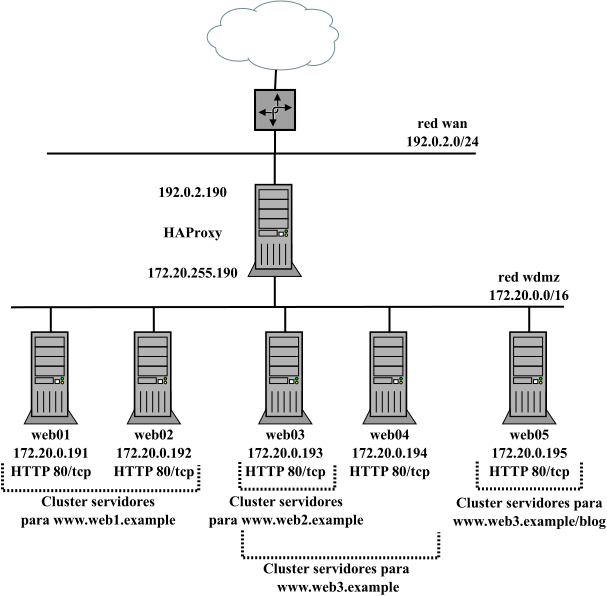

# Retos de ciberseguridade

Bienvenido/a al repositorio del proyecto <i>Repositorio de escenarios prácticos para despregue de infraestruturas en virtualización, contedores, cloud computing e exercicios de Red Team e Blue Team</i> que resultó premiado na <i>Resolución do 12 de maio de 2023 da Dirección Xeral de Formación Profesional pola que se resolven os premios para o desenvolvemento de proxectos de innovación tecnolóxica ou científica e proxectos de innovación didáctica no ámbito da Formación Profesional en centros públicos dependentes da Consellería de Cultura, Educación, Formación Profesional e Universidades convocados na resolución do 23 de xaneiro de 2023</i>.

El proyecto consiste en el desarrollo de archivos de configuración que permitirán el despliegue y configuración de forma automática de escenarios prácticos con máquinas virtuales y/o contenedores en local y/o en la nube, para la realización de prácticas en ciclos de Formación Profesional.

Aprovechando las tecnologías de IaC (Infrastructure as Code), aprovisionamiento (provisioning), gestión da configuración (configuration management) y control de versións (version control), ampliamente usadas en entornos TI modernos, se automatizará la creación de escenarios virtuales para prácticas, aumentando drásticamente la velocidad de creación y configuración, entre otros beneficios.

Los escenarios están clasificados por carpetas donde encontrarás:

- readme.md con información de la infraestructura a desplegar, las tecnologías de virtualización para las que está disponible e instrucciones para personalizar el despliegue y como realizarlo.
- carpetas con los archivos para realizar el despliegue en cuyo nombre aparece la tecnología de virtualización

Se pueden encontrar infraestructuras para desplegar usando VirtualBox con [Vagrant](https://www.vagrantup.com/), contenedores [LXD](https://canonical.com/lxd) y contenedores [INCUS](https://linuxcontainers.org/incus/introduction/). Para el aprovisionamiento se han empleado scripts en bash y [cloud-init](https://cloudinit.readthedocs.io/en/latest/), al ser ambos compatibles con despliegues en la nube (AWS, Google Cloud, Azure, ...); primándose la sencillez en todos ellos, para facilitar que el profesorado y alumnado pueda modificar los archivos de configuración de los escenarios para adaptarlos a sus necesidades.
A modo de ejemplo se puede ver uno de los escenarios prácticos a desplegar y cómo se realiza su despliegue usando contenedores:

Escenarios prácticos disponibles:

- **[web](./web)**: infraestructura formada por un servidor web corriendo Apache con PHP.
- **[lamp](./lamp)**: infraestructura formada por un servidor web corriendo jun sistema LAMP: Linux-Apache-PHP-MySQL. 
- **[web_db](./web_db)**: infraestructura formada por un servidor web Apache+PHP y un servidor de base de datos MySQL.
- **[cluster_web](./cluster_web)**: infraestructura formada un conjunto de servidores web idénticos corriendo Apache+PHP.
- **[ssh_fail2ban](./ssh_fail2ban)**: infraestructura formada por un servidor corriendo SSH y un equipo atacante para probar ataques de fuerza bruta y securización mediante el uso de [fail2ban](https://github.com/fail2ban/fail2ban).
- **[fw_lan](./fw_lan)**: infraestructura formada por un firewall de red que controla el tráfico de una organización pequeña, donde tiene que controlar el tráfico de salida de los equipos de los trabajadores y el tráfico entrante a un servidor.
- **[fw_lan_dmz](./fw_lan_dmz)**: infraestructura formada por un firewall de red que controla el tráfico de una organización, donde tiene que controlar el tráfico de salida de una LAN donde se ubican los equipos de los trabajadores y de una red DMZ donde se ubican servicios accesibles desde Internet.
- **[ha_lvs](./ha_lvs)**: infraestructura formada por un servidor que actuará como balanceador usando [LVS](http://www.linuxvirtualserver.org/whatis.html) en modo LVS-NAT y un cluster de 5 servidores web que dan servicio a dos sitios web. 
- **[ha_haproxy](./ha_haproxy)**: infraestructura formada por un servidor que actuará como balanceador usando [HAProxy](https://www.haproxy.org/) configurado como balanceador L7 y un cluster de 5 servidores web que dan servicio a dos sitios web. 
- **[ha_haproxy_esc2](./ha_haproxy_esc2)**: infraestructura formada por un servidor que actuará como balanceador usando [HAProxy](https://www.haproxy.org/) configurado como balanceador L7 y un cluster de 5 servidores web que dan servicio a tres sitios web y donde se las peticiones a un sitio web se redirigen en función de la URL solicitada por el cliente.
- **[GOAD](./GOAD)**: información relativa al despliegue y ejercicios de red team y blue team en el entorno de Active Directory Vulnerable [GOAD](https://github.com/Orange-Cyberdefense/GOAD).

---
 
<table align="center" cellspacing="50">
<tr>
   <td><h1 align=center><a href="https://www.iessanclemente.net/" target="_blank">IES San Clemente</a></h1></td>
   <td><h1 align=center><a href="https://www.cifprodolfoucha.es/"  target="_blank">CIFP Rodolfo Ucha Piñeiro</a></h1></td>
</tr>
<tr>
    <td></td>
    <td></td>
</tr>
</table>
      
 

      <h6>Actividade desenvolvida dentro do proxecto "Plataforma de retos de ciberseguridade. A gamificación no proceso de adquisición de competencias no ámbito da ciberseguridade", financiado na convocatoria de premios para o desenvolvemento de proxectos de innovación na FP do ano 2022.</h6>
