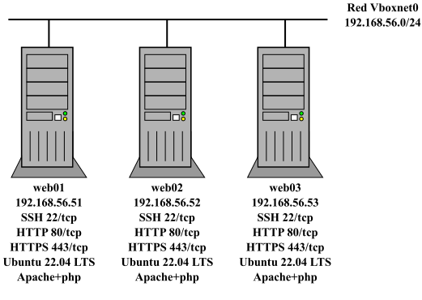
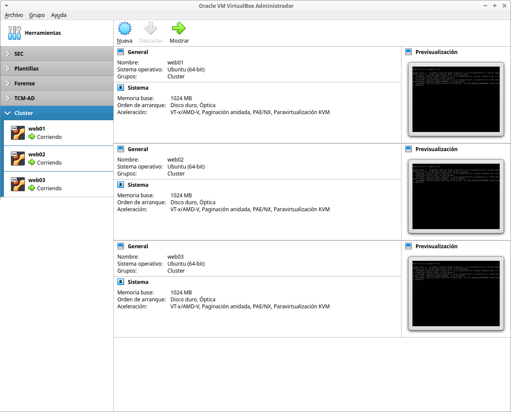
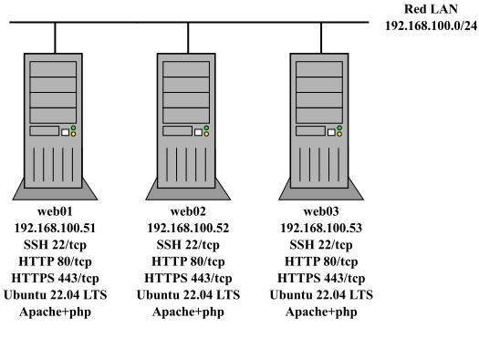

# Cluster Web

Infraestructura formada varios servidores web idénticos corriendo Apache+PHP.

- **Web01, Web02 y Web03**:
  - Ubuntu 22.04 LTS.
  - Apache con soporte para PHP y varios módulos PHP instalados (php-mbstring, php-xmlrpc, php-soap, php-gd, php-xml, php-intl, php-mysql, php-cli, php-zip, php-curl, ...).
  - Cliente MySQL y [Adminer](https://www.adminer.org/) para gestionar el servidor MySQL.
  - Página web básica index.php e info.php.

## Virtualbox



### Archivos

- **Vagrantfile**:
  - permite personalizar las *boxes* usadas, direcciones IP de las máquinas, caracterísiticas de las máquinas (RAM, cpu, gui visible o no, ...) y carpeta compartida entre la máquina web01 y el host anfitrión.
  - permite personalizar el número de servidor a desplegar a través del bucle `(1..3).each do |i|`. Por defecto se levantan 3 servidores web.

- **apache.sh**: script de aprovisionamiento para instalar y configurar el servidor web.

En el script de aprovisionamiento es posible definir una caché APT para acelerar el proceso de descarga de paquetes acelerando el proceso de instalación.

### Despliegue

```bash
$ for i in {1..3}; do mkdir web0$i ; done
$ ls -lhF
total 20K
-rw-rw-r-- 1 manuel manuel 1,4K mar 22 20:45 apache.sh
-rw-rw-r-- 1 manuel manuel  681 mar 28 21:48 Vagrantfile
drwxrwxr-x 2 manuel manuel 4,0K mar 29 22:29 web01/
drwxrwxr-x 2 manuel manuel 4,0K mar 29 22:29 web02/
drwxrwxr-x 2 manuel manuel 4,0K mar 29 22:29 web03/
$ vagrant validate
Vagrantfile validated successfully.
$ vagrant up
$ vagrant status
Current machine states:

web01                     running (virtualbox)
web02                     running (virtualbox)
web03                     running (virtualbox)

This environment represents multiple VMs. The VMs are all listed
above with their current state. For more information about a specific
VM, run `vagrant status NAME`
```


Para destruir la infraestructura:

```bash
$ vagrant destroy -f
==> web03: Forcing shutdown of VM...
==> web03: Destroying VM and associated drives...
==> web02: Forcing shutdown of VM...
==> web02: Destroying VM and associated drives...
==> web01: Forcing shutdown of VM...
==> web01: Destroying VM and associated drives...
```

## Incus /LXD



### Archivos

Similar para incus y lxd:

- **escenario_cluster_web_incus.sh**: script de despliegue de la infraestructura donde se puede controlar:
  - creación de la red LAN (nombre, dirección de red, rango de IPs asignadas por DHCP, ...).
  - creación *profile* LAN.
  - personalización de las direcciones IPs de los contenedores web y mysql.
  - personalización del número de servidor a desplegar a través de la variable `NUMERO`. Por defecto se levantan 3 servidores web.
- **config_web_PLANTILLA_incus.yml**: fichero de *cloud-init* que permiten configurar web y mysql.
  - nombre de equipo.
  - creación de un usuario adminsitrador *magasix*/abc123.
  - aplicar contraseña al usuario por defecto *ubuntu*/*abc123.*
  - permiten configurar caché APT para acelerar el proceso de descarga de paquetes.
  - instalación y configuración de paquetes (Apache, php, ...):
    - habilitar sitio http/https y crear páginas index.php, info.php y descargar [Adminer](https://www.adminer.org/).
    - acceso por SSH mediante contraseña (recomendado habilitar clave pública).
- **profile_LAN**: plantilla para crear profile LAN (una NIC conectada a la red LAN y una unidad de disco).
- **network_PLANTILLA.yml**: plantilla para personalizar la configuración de red de los contenedores

### Despliegue

Similar para incus y lxd: asignar permisos de ejecución al script y escoger la opción 1. 

```bash
$ chmod 755 escenario_cluster_web_incus.sh
$ ./escenario_cluster_web_incus.sh
----- Escenario Cluster Web -----
Seleccionar operación:
1. Crear escenario
2. Parar contenedores escenario
3. Arrancar contenedores escenario
4. Borrar escenario
------
1
Crear escenario
Network lan created
Perfil LAN creado
Launching web01
Launching web02
Launching web03
 
+-------+---------+-----------------------+----------+-----------+----------------------+--------------+
| NAME  |  STATE  |         IPV4          | PROFILES | SNAPSHOTS |     LAST USED AT     | MEMORY USAGE |
+-------+---------+-----------------------+----------+-----------+----------------------+--------------+
| web01 | RUNNING | 192.168.100.51 (eth0) | LAN      | 0         | 2024/03/29 22:36 CET | 38.25MiB     |
+-------+---------+-----------------------+----------+-----------+----------------------+--------------+
| web02 | RUNNING | 192.168.100.52 (eth0) | LAN      | 0         | 2024/03/29 22:36 CET | 38.32MiB     |
+-------+---------+-----------------------+----------+-----------+----------------------+--------------+
| web03 | RUNNING | 192.168.100.53 (eth0) | LAN      | 0         | 2024/03/29 22:36 CET | 38.32MiB     |
+-------+---------+-----------------------+----------+-----------+----------------------+--------------+
```

Una vez terminado el despliegue, hay que esperar unos minutos hasta que termine el aprovisionamiento de los contenedores (instalación de software y configuración del equipo). Se puede comprobar si ha terminado el proceso comprobando si los servicios http/https están levantados:

```bash
$ incus exec web01 -- ss -ltn
State            Recv-Q            Send-Q            Local Address:Port            Peer Address:Port            Process
LISTEN           0                 128                     0.0.0.0:22                   0.0.0.0:*
LISTEN           0                 4096              127.0.0.53%lo:53                   0.0.0.0:*
LISTEN           0                 511                           *:80                         *:*                       
LISTEN           0                 128                        [::]:22                      [::]:*
LISTEN           0                 511                           *:443                        *:*                       
$ incus exec web02 -- ss -ltn
State            Recv-Q            Send-Q            Local Address:Port            Peer Address:Port            Process
LISTEN           0                 151                     0.0.0.0:3306                 0.0.0.0:*
LISTEN           0                 70                     127.0.0.1:33060               0.0.0.0:*
LISTEN           0                 128                      0.0.0.0:22                  0.0.0.0:*
LISTEN           0                 4096               127.0.0.53%lo:53                  0.0.0.0:*
LISTEN           0                 128                         [::]:22                     [::]:* 
$ incus exec web03 -- ss -ltn
State            Recv-Q            Send-Q            Local Address:Port            Peer Address:Port            Process
LISTEN           0                 151                     0.0.0.0:3306                 0.0.0.0:*
LISTEN           0                 70                     127.0.0.1:33060               0.0.0.0:*
LISTEN           0                 128                      0.0.0.0:22                  0.0.0.0:*
LISTEN           0                 4096               127.0.0.53%lo:53                  0.0.0.0:*
LISTEN           0                 128                         [::]:22                     [::]:* 
```

O si cloud-init ha finalizado:

```bash
$ incus exec web03 -- tail /var/log/cloud-init-output.log
   200K .......... .......... .......... .......... .......... 53% 5.49M 0s
   250K .......... .......... .......... .......... .......... 64% 18.3M 0s
   300K .......... .......... .......... .......... .......... 75% 16.2M 0s
   350K .......... .......... .......... .......... .......... 85% 51.1M 0s
   400K .......... .......... .......... .......... .......... 96% 1022K 0s
   450K .......... .....                                      100% 32.8M=0.3s

2024-03-29 22:37:50 (1.56 MB/s) - ‘/var/www/html/adminer.php’ saved [476603/476603]

Cloud-init v. 23.4.4-0ubuntu0~22.04.1 finished at Fri, 29 Mar 2024 21:37:51 +0000. Datasource DataSourceNoCloud [seed=/var/lib/cloud/seed/nocloud-net][dsmode=net].  Up 67.30 second
```

Las opciones 2 y 3 permiten apagar y arrancar los contenedores respectivamente, y la opción 4 borra los contenedores pero no la red LAN ni el profile LAN por si se necesitan para otros escenarios.
