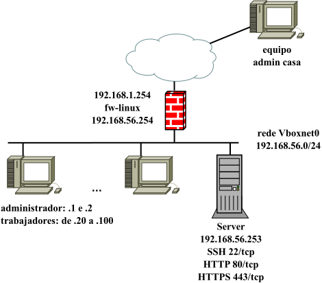
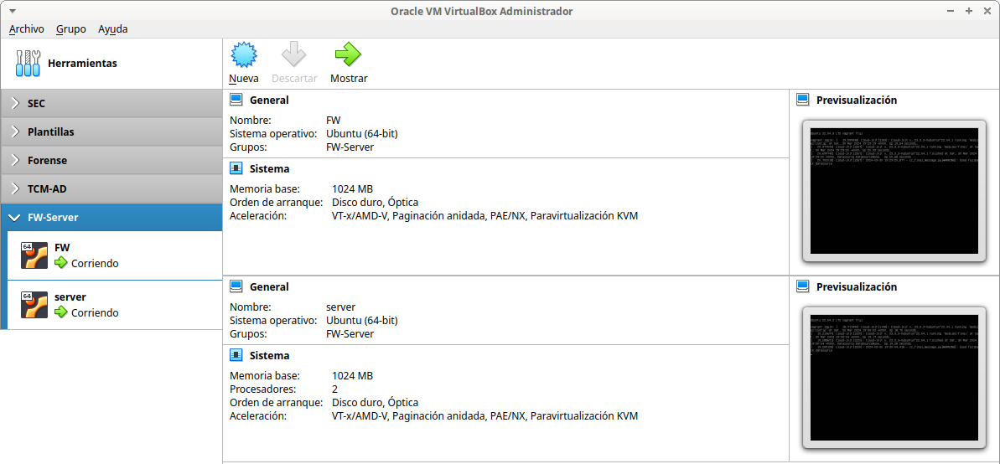
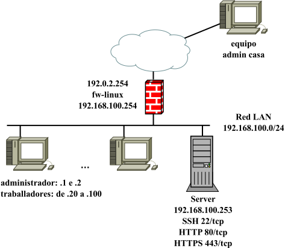

# FW LAN

Infraestructura formada por un firewall de red que controla el tráfico de una organización pequeña. La siguiente imagen refleja la infraestructura que se montará y un ejemplo de posible práctica donde:

- mediante iptables o nftables, el equipo fw controla el tráfico de una entidad que posee una red LAN donde están los equipos de sus trabajadores y un servidor que aloja algunos servicios que serán accesibles desde Internet..
- el fw ha de controlar el tráfico saliente y entrante de la red LAN.
- el fw ha de permitir el acceso desde el exterior a los servicios autorizados corriendo en el servidor.

Aunque no es la infraestructura de red deseable en términos de seguridad, la práctica sugerida permite configurar fw para actuar como firewall de red y aplicar las buenas prácticas a la hora de diseñar e implantar un cortafuegos como anti-lockdown rules, stealth rules, clean up rules, no logging rules, sneaky rules, ...

- **fw**:
  - Ubuntu 22.04 LTS.
- **server**:
  - Ubuntu 22.04 LTS.
  - servidor web con Apache+php.
  - su *default gateway* es el fw.

## Virtualbox



Las interfaces de fw están configuradas de la siguiente forma:

- como la interfaz *pública* está configurada en modo puente es necesario modificar el Vagrantfile para asignar valores adecuados a la red de casa/instituto (dirección IP, máscara de red y *default gateway*).
- la interfaz *interna* de fw está configurada en modo *host only* (solo anfitrión) usando la red 192.168.56.0/24.

### Archivos

- **Vagrantfile**: es posible personalizar las *boxes* usadas, direcciones IP de las máquinas, caracterísiticas de las máquinas (RAM, cpu, gui visible o no, ...) y carpeta compartida entre la máquina server y el host anfitrión.
- **lamp_generico.sh**: script de aprovisionamiento para instalar y configurar un sistema LAMP (Linux+Apache+PHP+MySQL).

### Despliegue

```bash
$ mkdir www
$ vagrant validate
Vagrantfile validated successfully.
$ vagrant up
$ vagrant status
Current machine states:

fw                        running (virtualbox)
server                    running (virtualbox)

This environment represents multiple VMs. The VMs are all listed
above with their current state. For more information about a specific
VM, run `vagrant status NAME`.
```

[](https://asciinema.org/a/7ywjBXEQ7tEsFXIaOQlevbIqc)



Para destruir la infraestructura:

```bash
$ vagrant destroy -f
==> server: Forcing shutdown of VM...
==> server: Destroying VM and associated drives...
==> fw: Forcing shutdown of VM...
==> fw: Destroying VM and associated drives..
```

## Incus /LXD



### Archivos

Similar para incus y lxd:

- **escenario_fw_lan_incus.sh**: script de despliegue de la infraestructura donde se puede controlar:
  - creación de la red WAN (nombre, dirección de red, rango de IPs asignadas por DHCP, ...). Se usa la red 192.0.2.0/24 (TEST-NET-1) para simular direcciones IP públicas de Internet.
  - creación de la red LAN (nombre, dirección de red, rango de IPs asignadas por DHCP, ...). Se usa la red privada 192.168.100.0/24.
  - creación *profiles* LAN y WAN-LAN.
  - personalización de las direcciones IPs de los contenedores fw y server.
- **config_fw_incus.yml**: fichero de *cloud-init* que permite configurar el equipo fw.
- **config_server_incus.yml**: fichero de *cloud-init* que permite configurar el servidor de la organización:
  - nombre de equipo.
  - creación de un usuario adminsitrador *magasix*/*abc123.*
  - aplicar contraseña al usuario por defecto *ubuntu*/*abc123.*
  - permite configurar caché APT para acelerar el proceso de descarga de paquetes.
  - instalación y configuración de paquetes (Apache, php, MySQL, ...):
    - habilitar sitio http/https y crear páginas index.php, info.php y descargar [Adminer](https://www.adminer.org/).
    - instalación básica de MySQL server.
    - acceso por SSH mediante contraseña (recomendado habilitar clave pública).
- **profile_LAN**: plantilla para crear el *profile* LAN (una NIC conectada a la red LAN y una unidad de disco).
- **profile_WAN-LAN**: plantilla para crear *profile* WAN-LAN (una NIC conectada a la red WAN, otra a la red LAN y una unidad de disco).
- **network_2NICS_PLANTILLA.yml**: plantilla para personalizar la configuración de red del contenedor fw.
- **network_PLANTILLA.yml**: plantilla para personalizar la configuración de red del contenedor server.

### Despliegue

Similar para incus y lxd: asignar permisos de ejecución al script y escoger la opción 1. 

[](https://asciinema.org/a/XGGL8FnuLj5obejQRCR4cZB04)

```bash
$ chmod 755 escenario_fw_lan_incus.sh
$ ./escenario_fw_lan_incus.sh
----- Escenario FW-LAN -----
Seleccionar operación:
1. Crear escenario
2. Parar contenedores escenario
3. Arrancar contenedores escenario
4. Borrar escenario
------
1
Crear escenario
Network wan created
Network lan created
Perfil WAN-LAN creado
Perfil LAN creado
------------------------------
     creando firewall       
------------------------------
Launching fw
------------------------------
     creando server     
------------------------------
Launching server
 
+--------+---------+------------------------+----------+-----------+----------------------+
|  NAME  |  STATE  |          IPV4          | PROFILES | SNAPSHOTS |     LAST USED AT     |
+--------+---------+------------------------+----------+-----------+----------------------+
| fw     | RUNNING | 192.168.100.254 (eth1) | WAN-LAN  | 0         | 2024/03/30 20:44 CET |
|        |         | 192.0.2.254 (eth0)     |          |           |                      |
+--------+---------+------------------------+----------+-----------+----------------------+
| server | RUNNING | 192.168.100.253 (eth0) | LAN      | 0         | 2024/03/30 20:44 CET |
+--------+---------+------------------------+----------+-----------+----------------------+
```

Una vez terminado el despliegue, hay que esperar unos minutos hasta que termine el aprovisionamiento de los contenedores (instalación de software y configuración del equipo). Se puede comprobar si ha terminado el proceso por ejemplo verificando que los servicios web y ssh corriendo en server están levantados:

```bash
$ incus exec server -- ss -ltn | grep -E "80|443|22"
LISTEN 0      128          0.0.0.0:22        0.0.0.0:*          
LISTEN 0      511                *:443             *:*          
LISTEN 0      128             [::]:22           [::]:*          
LISTEN 0      511                *:80              *:* 
```

O si cloud-init ha finalizado:

```bash
$ incus exec server -- tail /var/log/cloud-init-output.log
   200K .......... .......... .......... .......... .......... 53% 12.4M 0s
   250K .......... .......... .......... .......... .......... 64% 47.9M 0s
   300K .......... .......... .......... .......... .......... 75% 23.2M 0s
   350K .......... .......... .......... .......... .......... 85% 1008K 0s
   400K .......... .......... .......... .......... .......... 96% 24.5M 0s
   450K .......... .....                                      100%  115M=0.3s

2024-03-30 20:54:21 (1.56 MB/s) - ‘/var/www/html/adminer.php’ saved [476603/476603]

Cloud-init v. 23.4.4-0ubuntu0~22.04.1 finished at Sat, 30 Mar 2024 19:54:22 +0000. Datasource DataSourceNoCloud [seed=/var/lib/cloud/seed/nocloud-net][dsmode=net].  Up 83.50 seconds
```

Las opciones 2 y 3 permiten apagar y arrancar los contenedores respectivamente, y la opción 4 borra todos los contenedores pero no las redes WAN y DMZ ni los profiles por si se quieren usar para otros despliegues.
