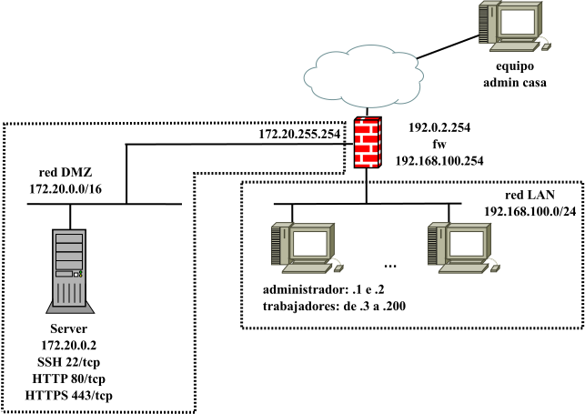

# FW LAN-DMZ

Infraestructura formada por un firewall de red que controla el tráfico de una organización. La siguiente imagen refleja la infraestructura que se montará y un ejemplo de posible práctica donde:

- mediante iptables o nftables, el equipo fw controla el tráfico de una entidad que posee una red LAN donde están los equipos de sus trabajadores y una red DMZ donde hay un servidor.
- el fw ha de controlar el tráfico saliente de la red LAN.
- el fw ha de permitir el acceso desde el exterior a los servicios autorizados corriendo en el servidor de la DMZ.

La práctica sugerida permite configurar fw para actuar como firewall de red y aplicar las buenas prácticas a la hora de diseñar e implantar un cortafuegos como anti-lockdown rules, stealth rules, clean up rules, no logging rules, sneaky rules, ...



- **fw**:
  - Ubuntu 22.04 LTS.
- **server**:
  - Ubuntu 22.04 LTS.
  - servidor web con Apache+php.
  - su *default gateway* es el fw (172.20.255.254)
- **admin2**:
  - Ubuntu 22.04 LTS.
  - equipo con la IP .2 de la LAN para actuar como el equipo de uno de los administradores de sistemas de la organización y al que se le autoriza más tráfico que a los equipos de los trabajadores normales.
  - su *default gateway* es el fw (192.168.100.254)


## Incus /LXD

### Archivos

Similar para incus y lxd:

- **escenario_fw_dmz_incus.sh**: script de despliegue de la infraestructura donde se puede controlar:
  - creación de la red WAN (nombre, dirección de red, rango de IPs asignadas por DHCP, ...). Se usa la red 192.0.2.0/24 (TEST-NET-1) para simular direcciones IP públicas de Internet.
  - creación de la red DMZ (nombre, dirección de red, rango de IPs asignadas por DHCP, ...). Se usa la red privada 172.20.0.0/16.
  - creación de la red LAn (nombre, dirección de red, rango de IPs asignadas por DHCP, ...). Se usa la red privada 192.168.100.0/24.
  - creación *profiles* DMZ, LAN y WAN-LAn-DMZ
  - personalización de las direcciones IPs de los contenedores fw, server y admin2.
- **config_fw_incus.yml**: ficheros de *cloud-init* que permite configurar los equipos fw y admin2.
- **config_server_incus.yml**: fichero de *cloud-init* que permiten configurar el servidor de la DMZ:
  - nombre de equipo.
  - creación de un usuario adminsitrador *magasix*/*abc123.*
  - aplicar contraseña al usuario por defecto *ubuntu*/*abc123.*
  - permiten configurar caché APT para acelerar el proceso de descarga de paquetes.
  - instalación y configuración de paquetes (Apache, php, ...):
    - habilitar sitio http/https y crear páginas index.php, info.php y descargar [Adminer](https://www.adminer.org/).
    - acceso por SSH mediante contraseña (recomendado habilitar clave pública).
- **profile_DMZ**: plantilla para crear el *profile* DMZ (una NIC conectada a la red DMZ y una unidad de disco).
- **profile_LAN**: plantilla para crear el *profile* LAN (una NIC conectada a la red LAN y una unidad de disco).
- **profile_WAN-LAN-DMZ**: plantilla para crear *profile* WAN-LAN-DMZ (una NIC conectada a la red WAN, otra a la red LAN, otra a la red DMZ y una unidad de disco).
- **network_3NICS_PLANTILLA.yml**: plantilla para personalizar la configuración de red del contenedor fw.
- **network_PLANTILLA.yml**: plantilla para personalizar la configuración de red de los contenedores server y admin2.

### Despliegue

Similar para incus y lxd: asignar permisos de ejecución al script y escoger la opción 1. 
[](https://asciinema.org/a/kKSyX57FV2BM5Km8GHmm2EiH0)

```bash
$ chmod 755 escenario_fw_dmz_incus.sh
$ ./escenario_fw_dmz_incus.sh
----- Escenario FW-LAN-DMZ -----
Seleccionar operación:
1. Crear escenario
2. Parar contenedores escenario
3. Arrancar contenedores escenario
4. Borrar escenario
------
1
Crear escenario
Network wan created
Network lan created
Network dmz created
Perfil WAN-LAN-DMZ creado
Perfil LAN creado
Perfil DMZ creado
------------------------------
     creando firewall       
------------------------------
Launching fw
------------------------------
        creando server        
------------------------------
Launching server
------------------------------
        creando admin 2       
------------------------------
Launching admin2
 
+--------+---------+------------------------+-------------+-----------+----------------------+
|  NAME  |  STATE  |          IPV4          |  PROFILES   | SNAPSHOTS |     LAST USED AT     |
+--------+---------+------------------------+-------------+-----------+----------------------+
| admin2 | RUNNING | 192.168.100.2 (eth0)   | LAN         | 0         | 2024/03/30 20:00 CET |
+--------+---------+------------------------+-------------+-----------+----------------------+
| fw     | RUNNING | 192.168.100.254 (eth1) | WAN-LAN-DMZ | 0         | 2024/03/30 19:59 CET |
|        |         | 192.0.2.254 (eth0)     |             |           |                      |
|        |         | 172.20.255.254 (eth2)  |             |           |                      |
+--------+---------+------------------------+-------------+-----------+----------------------+
| server | RUNNING | 172.20.0.2 (eth0)      | DMZ         | 0         | 2024/03/30 19:59 CET |
+--------+---------+-----------------------+-------------+-----------+----------------------+
```

Una vez terminado el despliegue, hay que esperar unos minutos hasta que termine el aprovisionamiento de los contenedores (instalación de software y configuración del equipo). Se puede comprobar si ha terminado el proceso por ejemplo verificando que los servicios web y ssh corriendo en server están levantados:

```bash
$ incus exec server -- ss -ltn | grep -E "80|443|22"
LISTEN 0      128          0.0.0.0:22        0.0.0.0:*          
LISTEN 0      511                *:443             *:*          
LISTEN 0      128             [::]:22           [::]:*          
LISTEN 0      511                *:80              *:* 
```

O si cloud-init ha finalizado:

```bash
$ incus exec server -- tail /var/log/cloud-init-output.log
   200K .......... .......... .......... .......... .......... 53% 18.9M 0s
   250K .......... .......... .......... .......... .......... 64% 35.8M 0s
   300K .......... .......... .......... .......... .......... 75%  964K 0s
   350K .......... .......... .......... .......... .......... 85% 58.8M 0s
   400K .......... .......... .......... .......... .......... 96% 59.2M 0s
   450K .......... .....                                      100% 37.1M=0.3s

2024-03-30 20:01:40 (1.60 MB/s) - ‘/var/www/html/adminer.php’ saved [476603/476603]

Cloud-init v. 23.4.4-0ubuntu0~22.04.1 finished at Sat, 30 Mar 2024 19:01:41 +0000. Datasource DataSourceNoCloud [seed=/var/lib/cloud/seed/nocloud-net][dsmode=net].  Up 101.26 seconds
```

Las opciones 2 y 3 permiten apagar y arrancar los contenedores respectivamente, y la opción 4 borra todos los contenedores pero no las redes WAN y DMZ ni los profiles por si se quieren usar para otros despliegues.
