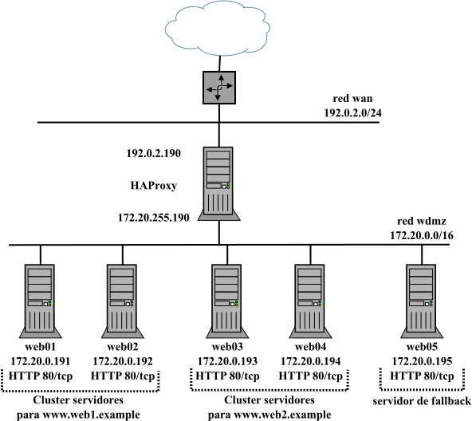

# HA HAProxy

Infraestructura formada por un servidor que actuará como balanceador usando [HAProxy](https://www.haproxy.org/) y un cluster de 5 servidores web. La siguiente imagen refleja la infraestructura que se montará y un ejemplo de posible práctica donde:

- web01 y web02 dan servicio a un sitio web (web1.example).
- web03 y web04 dan servicio al sitio web web2.example. 
- web05 actúa como servidor de *fall back* (actuará en caso de caída de los servidores web asociados a un *backend*).

La práctica sugerida permite configurar HAProxy actuando como balanceador de tipo L7, terminador SSL, probar diferentes algoritmos de balanceo para web1.example y web2.example, configurar diferentes sistemas de monitorización de los servidores de los *backends* por parte de HAProxy y ver como el balanceador toma decisiones de reenvío en base a las ACLs establecidas, algoritmos de balanceo definidos y el estado de los servidores del cluster.



- **HAProxy**:
  - Ubuntu 22.04 LTS.
- **Web01, web02, web03, web04, web05**:
  - Ubuntu 22.04 LTS.
  - Servidores web con Apache+php.

## Incus /LXD

### Archivos

Similar para incus y lxd:

- **escenario_ha_haproxy_incus.sh**: script de despliegue de la infraestructura donde se puede controlar:
  - creación de la red WAN (nombre, dirección de red, rango de IPs asignadas por DHCP, ...). Se usa la red 192.0.2.0/24 (TEST-NET-1) para simular direcciones IP públicas de Internet.
  - creación de la red DMZ (nombre, dirección de red, rango de IPs asignadas por DHCP, ...).
  - creación *profiles* DMZ y WAN-DMZ
  - personalización de las direcciones IPs de los contenedores haproxy, web01, web02, web03, web04 y web05.
- **config_haproxy_incus.yml** y **config_server_incus_PLANTILLA.yml**: ficheros de *cloud-init* que permiten configurar el balanceador y los servidores web:
  - nombre de equipo.
  - creación de un usuario adminsitrador *magasix*/*abc123.*
  - aplicar contraseña al usuario por defecto *ubuntu*/*abc123.*
  - permiten configurar caché APT para acelerar el proceso de descarga de paquetes.
  - instalación y configuración de paquetes (Apache, php, ...) en cluster web:
    - habilitar sitio http/https y crear páginas index.php, info.php y test.html.
    - acceso por SSH mediante contraseña (recomendado habilitar clave pública).
- **profile_DMZ**: plantilla para crear profile DMZ (una NIC conectada a la red DMZ y una unidad de disco).
- **profile_WAN-DMZ**: plantilla para crear profile WAN-DMZ (una NIC conectada a la red WAN, otra a la red DMZ y una unidad de disco).
- **network_2NICS_PLANTILLA.yml**: plantilla para personalizar la configuración de red del contenedor haproxy.
- **network_PLANTILLA.yml**: plantilla para personalizar la configuración de red de los contenedores del cluster web.

### Despliegue

Similar para incus y lxd: asignar permisos de ejecución al script y escoger la opción 1. 

[](https://asciinema.org/a/mIbQt8G8zHodq6d9KwHjbmqb6)

```bash
$ chmod 755 escenario_ha_haproxy_incus.sh
$ ./escenario_ha_haproxy_incus.sh
----- Escenario HA HAproxy -----
Seleccionar operación:
1. Crear escenario
2. Parar contenedores escenario
3. Arrancar contenedores escenario
4. Borrar escenario
------
1
Crear escenario
Network wan created
Network dmz created
Perfil WAN-DMZ creado
Perfil DMZ creado
------------------------------
     creando HAproxy       
------------------------------
Launching haproxy
------------------------------
        creando servers        
------------------------------
Launching haproxy-php-01
Launching haproxy-php-02
Launching haproxy-php-03
Launching haproxy-php-04
Launching haproxy-php-05
 
+----------------+---------+-----------------------+----------+-----------+----------------------+
|      NAME      |  STATE  |         IPV4          | PROFILES | SNAPSHOTS |     LAST USED AT     |
+----------------+---------+-----------------------+----------+-----------+----------------------+
| haproxy        | RUNNING | 192.0.2.190 (eth0)    | WAN-DMZ  | 0         | 2024/03/30 17:39 CET |
|                |         | 172.20.255.190 (eth1) |          |           |                      |
+----------------+---------+-----------------------+----------+-----------+----------------------+
| haproxy-php-01 | RUNNING | 172.20.0.191 (eth0)   | DMZ      | 0         | 2024/03/30 17:39 CET |
+----------------+---------+-----------------------+----------+-----------+----------------------+
| haproxy-php-02 | RUNNING | 172.20.0.192 (eth0)   | DMZ      | 0         | 2024/03/30 17:39 CET |
+----------------+---------+-----------------------+----------+-----------+----------------------+
| haproxy-php-03 | RUNNING | 172.20.0.193 (eth0)   | DMZ      | 0         | 2024/03/30 17:39 CET |
+----------------+---------+-----------------------+----------+-----------+----------------------+
| haproxy-php-04 | RUNNING | 172.20.0.194 (eth0)   | DMZ      | 0         | 2024/03/30 17:39 CET |
+----------------+---------+-----------------------+----------+-----------+----------------------+
| haproxy-php-05 | RUNNING | 172.20.0.195 (eth0)   | DMZ      | 0         | 2024/03/30 17:39 CET |
+----------------+---------+-----------------------+----------+-----------+----------------------+
```

Una vez terminado el despliegue, hay que esperar unos minutos hasta que termine el aprovisionamiento de los contenedores (instalación de software y configuración del equipo). Se puede comprobar si ha terminado el proceso por ejemplo verificando que el servidor web está levantado:

```bash
$ for i in {1..5}; do echo -e "----\nhaproxy-php-0$i\n----" ; incus exec haproxy-php-0$i -- ss -ltn | grep -E "80|443" ; done
----
haproxy-php-01
----
LISTEN 0      511                *:443             *:*          
LISTEN 0      511                *:80              *:*          
----
haproxy-php-02
----
LISTEN 0      511                *:443             *:*          
LISTEN 0      511                *:80              *:*          
----
haproxy-php-03
----
LISTEN 0      511                *:443             *:*          
LISTEN 0      511                *:80              *:*          
----
haproxy-php-04
----
LISTEN 0      511                *:80              *:*          
LISTEN 0      511                *:443             *:*          
----
haproxy-php-05
----
LISTEN 0      511                *:80              *:*          
LISTEN 0      511                *:443             *:* 
```

O si cloud-init ha finalizado:

```bash
$ incus exec haproxy-php-05 -- tail /var/log/cloud-init-output.log
Considering dependency socache_shmcb for ssl:
Enabling module socache_shmcb.
Enabling module ssl.
See /usr/share/doc/apache2/README.Debian.gz on how to configure SSL and create self-signed certificates.
To activate the new configuration, you need to run:
  systemctl restart apache2
Enabling site default-ssl.
To activate the new configuration, you need to run:
  systemctl reload apache2
Cloud-init v. 23.4.4-0ubuntu0~22.04.1 finished at Sat, 30 Mar 2024 16:41:06 +0000. Datasource DataSourceNoCloud [seed=/var/lib/cloud/seed/nocloud-net][dsmode=net].  Up 88.10 seconds
```

Las opciones 2 y 3 permiten apagar y arrancar los contenedores respectivamente, y la opción 4 borra todos los contenedores pero no las redes WAN y DMZ ni los profiles por si se quieren usar para otros despliegues.
