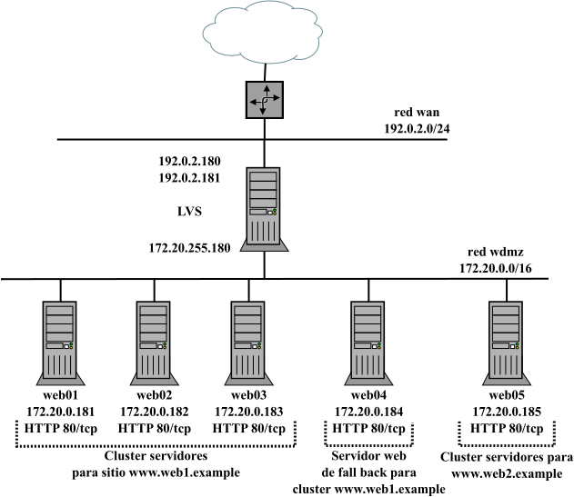

# HA LVS

Infraestructura formada por un servidor que actuará como balanceador usando [LVS](http://www.linuxvirtualserver.org/whatis.html) y un cluster de 5 servidores web. La siguiente imagen refleja la infraestructura que se montará y un ejemplo de posible práctica donde:

- web01, web02 y web03 dan servicio a un sitio web (web1.example).
- web04 actúa como servidor de *fall back* (actuará en caso de caída de web01, web02 y web03).
- web05 da servicio al sitio web web2.example. 

La práctica sugerida permite configurar LVS en modo NAT actuando como balanceador de tipo L4, probar diferentes algoritmos de balanceo para web1.example, configurar diferentes sistemas de monitorización del cluster por parte de LVS y ver como el balanceador toma decisiones de reenvío en base al algoritmo de balanceo configurado y el estado de los servidores del cluster.



- **LVS**:
  - Ubuntu 22.04 LTS.
  - Activados módulos del Kernel necesarios para que funcione LVS. Ya que IPVS es el componente que se encarga del balanceo de carga y está integrado en el Kernel de Linux; y el equipo anfitrión y el contenedor comparten el mismo Kernel, es necesario habilitar los módulos necesarios a la hora de crear el contenedor.
- **Web01, web02, web03, web04, web05**:
  - Ubuntu 22.04 LTS.
  - Servidores web con Apache+php.
  - Con la IP de la dmz de LVS como *default gateway* para poder configurarse el modo LVS-NAT en LVS.

## Incus /LXD

### Archivos

Similar para incus y lxd:

- **escenario_ha_lvs_incus.sh**: script de despliegue de la infraestructura donde se puede controlar:
  - creación de la red WAN (nombre, dirección de red, rango de IPs asignadas por DHCP, ...). Se usa la red 192.0.2.0/24 (TEST-NET-1) para simular direcciones IP públicas de Internet.
  - creación de la red DMZ (nombre, dirección de red, rango de IPs asignadas por DHCP, ...).
  - creación *profiles* DMZ y WAN-DMZ
  - personalización de las direcciones IPs de los contenedores lvs, web01, web02, web03, web04 y web05.
- **config_lvs_incus.yml** y **config_server_incus_PLANTILLA.yml**: ficheros de *cloud-init* que permiten configurar el balanceador y los servidores web:
  - nombre de equipo.
  - creación de un usuario adminsitrador *magasix*/abc123.
  - aplicar contraseña al usuario por defecto *ubuntu*/*abc123.*
  - permiten configurar caché APT para acelerar el proceso de descarga de paquetes.
  - instalación y configuración de paquetes (Apache, php, ...) en cluster web:
    - habilitar sitio http/https y crear páginas index.php, info.php y test.html.
    - acceso por SSH mediante contraseña (recomendado habilitar clave pública).
- **profile_DMZ**: plantilla para crear profile DMZ (una NIC conectada a la red DMZ y una unidad de disco).
- **profile_WAN-DMZ**: plantilla para crear profile WAN-DMZ (una NIC conectada a la red WAN, otra a la red DMZ y una unidad de disco).
- **network_2NICS_PLANTILLA.yml**: plantilla para personalizar la configuración de red del contenedor lvs.
- **network_PLANTILLA.yml**: plantilla para personalizar la configuración de red de los contenedores del cluster web.

### Despliegue

Similar para incus y lxd: asignar permisos de ejecución al script y escoger la opción 1. 

[](https://asciinema.org/a/GViKkRHu0O4EWGQsRRv6hNqCf)

```bash
$ chmod 755 escenario_ha_lvs_incus.sh
$ ./escenario_ha_lvs_incus.sh
----- Escenario HA LVS -----
Seleccionar operación:
1. Crear escenario
2. Parar contenedores escenario
3. Arrancar contenedores escenario
4. Borrar escenario
------
1
Crear escenario
Network wan created
Network dmz created
Perfil WAN-DMZ creado
Perfil DMZ creado
------------------------------
     creando LVS       
------------------------------
Launching lvs
------------------------------
        creando servers        
------------------------------
Launching lvs-php-01
Launching lvs-php-02
Launching lvs-php-03
Launching lvs-php-04
Launching lvs-php-05
 
+------------+---------+-----------------------+----------+-----------+----------------------+
|    NAME    |  STATE  |         IPV4          | PROFILES | SNAPSHOTS |     LAST USED AT     |
+------------+---------+-----------------------+----------+-----------+----------------------+
| lvs        | RUNNING | 192.0.2.181 (eth0)    | WAN-DMZ  | 0         | 2024/03/30 11:33 CET |
|            |         | 192.0.2.180 (eth0)    |          |           |                      |
|            |         | 172.20.255.180 (eth1) |          |           |                      |
+------------+---------+-----------------------+----------+-----------+----------------------+
| lvs-php-01 | RUNNING | 172.20.0.181 (eth0)   | DMZ      | 0         | 2024/03/30 11:33 CET |
+------------+---------+-----------------------+----------+-----------+----------------------+
| lvs-php-02 | RUNNING | 172.20.0.182 (eth0)   | DMZ      | 0         | 2024/03/30 11:33 CET |
+------------+---------+-----------------------+----------+-----------+----------------------+
| lvs-php-03 | RUNNING | 172.20.0.183 (eth0)   | DMZ      | 0         | 2024/03/30 11:33 CET |
+------------+---------+-----------------------+----------+-----------+----------------------+
| lvs-php-04 | RUNNING | 172.20.0.184 (eth0)   | DMZ      | 0         | 2024/03/30 11:33 CET |
+------------+---------+-----------------------+----------+-----------+----------------------+
| lvs-php-05 | RUNNING | 172.20.0.185 (eth0)   | DMZ      | 0         | 2024/03/30 11:33 CET |
+------------+---------+-----------------------+----------+-----------+----------------------+
```

Una vez terminado el despliegue, hay que esperar unos minutos hasta que termine el aprovisionamiento de los contenedores (instalación de software y configuración del equipo). Se puede comprobar si ha terminado el proceso por ejemplo verificando que el servidor web está levantado:

```bash
$ for i in {1..5}; do echo -e "----\nlvs-php-0$i\n----" ; incus exec lvs-php-0$i -- ss -ltn | grep -E "80|443" ; done
----
lvs-php-01
----
LISTEN 0      511                *:443             *:*          
LISTEN 0      511                *:80              *:*          
----
lvs-php-02
----
LISTEN 0      511                *:443             *:*          
LISTEN 0      511                *:80              *:*          
----
lvs-php-03
----
LISTEN 0      511                *:443             *:*          
LISTEN 0      511                *:80              *:*          
----
lvs-php-04
----
LISTEN 0      511                *:80              *:*          
LISTEN 0      511                *:443             *:*          
----
lvs-php-05
----
LISTEN 0      511                *:80              *:*          
LISTEN 0      511                *:443             *:* 
```

O si cloud-init ha finalizado:

```bash
$ incus exec lvs-php-05 -- tail /var/log/cloud-init-output.log
   200K .......... .......... .......... .......... .......... 53%  979K 0s
   250K .......... .......... .......... .......... .......... 64% 11.3M 0s
   300K .......... .......... .......... .......... .......... 75% 39.2M 0s
   350K .......... .......... .......... .......... .......... 85% 57.9M 0s
   400K .......... .......... .......... .......... .......... 96% 1.01M 0s
   450K .......... .....                                      100%  107M=0.3s

2024-03-30 11:35:17 (1.61 MB/s) - ‘/var/www/html/adminer.php’ saved [476603/476603]

Cloud-init v. 23.4.4-0ubuntu0~22.04.1 finished at Sat, 30 Mar 2024 10:35:18 +0000. Datasource DataSourceNoCloud [seed=/var/lib/cloud/seed/nocloud-net][dsmode=net].  Up 86.55 second
```

Las opciones 2 y 3 permiten apagar y arrancar los contenedores respectivamente, y la opción 4 borra todos los contenedores pero no las redes WAN y DMZ ni los profiles por si se quieren usar para otros despliegues.
