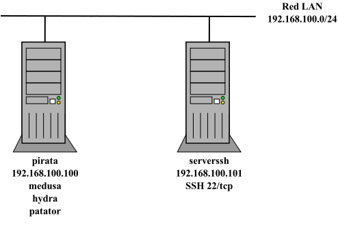

# SSH Fail2ban

Infraestructura formada por un servidor corriendo SSH y un equipo atacante para probar ataques de fuerza bruta y securización mediante el uso de [fail2ban](https://github.com/fail2ban/fail2ban).

- **Serverssh**:
  - Ubuntu 22.04 LTS.
  - Corriendo OpenSSH con autenticación por contraseñas habilitada.
  - Usuarios administradores: *magasix*/*abc123.* y *ubuntu*/*abc123.*
  - Varios usuarios a atacar cuyas contraseñas están en el diccionario [rockyou](https://github.com/danielmiessler/SecLists/blob/master/Passwords/Leaked-Databases/rockyou-50.txt): *asir01*, *asir02*, *asir03* y *asir04*.
- **Pirata**:
  - Ubuntu 22.04 LTS.
  - Equipo con software para realizar ataques de contraseñas: *medusa*, *hydra* y *patator*.

## Incus /LXD



### Archivos

Similar para incus y lxd:

- **escenario_ssh_fail2ban_incus.sh**: script de despliegue de la infraestructura donde se puede controlar:
  - creación de la red LAN (nombre, dirección de red, rango de IPs asignadas por DHCP, ...).
  - creación *profile* LAN.
  - personalización de las direcciones IPs de los contenedores serverssh y pirata.
- **config_serverssh_incus.yml** y **config_pirata_incus.yml**: ficheros de *cloud-init* que permiten serverssh y pirata.
  - nombre de equipo.
  - creación de un usuario adminsitrador *magasix*/abc123.
  - aplicar contraseña al usuario por defecto *ubuntu*/*abc123.*
  - permiten configurar caché APT para acelerar el proceso de descarga de paquetes.
  - creación de usuarios adicionales para atacar.
  - instalación y configuración de paquetes.
- **profile_LAN**: plantilla para crear profile LAN (una NIC conectada a la red LAN y una unidad de disco).
- **network_PLANTILLA.yml**: plantilla para personalizar la configuración de red de los contenedores
- **rockyou-50.txt**: diccionario de ejemplo con contraseñas para realizar el ataque.

### Despliegue

Similar para incus y lxd: asignar permisos de ejecución al script y escoger la opción 1. 

```bash
$ chmod 755 escenario_ssh_fail2ban_incus.sh
$ ./escenario_ssh_fail2ban_incus.sh
----- Escenario SSH - fail2ban -----
Seleccionar operación:
1. Crear escenario
2. Parar contenedores escenario
3. Arrancar contenedores escenario
4. Borrar escenario
------
1
Crear escenario
Network lan created
Perfil LAN creado
------------------------------
    creando servidor SSH      
------------------------------
Launching serverssh
------------------------------
       creando pirata        
------------------------------
Launching pirata
 
+-----------+---------+------------------------+----------+-----------+----------------------+
|   NAME    |  STATE  |          IPV4          | PROFILES | SNAPSHOTS |     LAST USED AT     |
+-----------+---------+------------------------+----------+-----------+----------------------+
| pirata    | RUNNING | 192.168.100.100 (eth0) | LAN      | 0         | 2024/03/29 22:18 CET |
+-----------+---------+------------------------+----------+-----------+----------------------+
| serverssh | RUNNING | 192.168.100.101 (eth0) | LAN      | 0         | 2024/03/29 22:18 CET |
+-----------+---------+------------------------+----------+-----------+----------------------+
```

Una vez terminado el despliegue, hay que esperar unos minutos hasta que termine el aprovisionamiento de los contenedores (instalación de software y configuración del equipo). Se puede comprobar si ha terminado el proceso verificando que el servicio SSH de serverssh está levantado y ha terminado la instalación de software como *medusa* en pirata:

```bash
$ incus exec serverssh -- ss -ltn
State            Recv-Q            Send-Q            Local Address:Port            Peer Address:Port            Process
LISTEN           0                 4096              127.0.0.53%lo:53                   0.0.0.0:*
LISTEN           0                 128                     0.0.0.0:22                   0.0.0.0:*
LISTEN           0                 128                        [::]:22                      [::]:*

$ incus exec pirata -- medusa -- help
Medusa v2.2 [http://www.foofus.net] (C) JoMo-Kun / Foofus Networks <jmk@foofus.net>

ALERT: Host information must be supplied.

Syntax: Medusa [-h host|-H file] [-u username|-U file] [-p password|-P file] [-C file] -M module [OPT]
  -h [TEXT]    : Target hostname or IP address
  -H [FILE]    : File containing target hostnames or IP addresses
  -u [TEXT]    : Username to test
  -U [FILE]    : File containing usernames to test
  -p [TEXT]    : Password to test
  -P [FILE]    : File containing passwords to test
  -C [FILE]    : File containing combo entries. See README for more information.
  -O [FILE]    : File to append log information to
  -e [n/s/ns]  : Additional password checks ([n] No Password, [s] Password = Username)
  -M [TEXT]    : Name of the module to execute (without the .mod extension)
  -m [TEXT]    : Parameter to pass to the module. This can be passed multiple times with a
                 different parameter each time and they will all be sent to the module (i.e.
                 -m Param1 -m Param2, etc.)
  -d           : Dump all known modules
  -n [NUM]     : Use for non-default TCP port number
  -s           : Enable SSL
  -g [NUM]     : Give up after trying to connect for NUM seconds (default 3)
  -r [NUM]     : Sleep NUM seconds between retry attempts (default 3)
  -R [NUM]     : Attempt NUM retries before giving up. The total number of attempts will be NUM + 1.
  -c [NUM]     : Time to wait in usec to verify socket is available (default 500 usec).
  -t [NUM]     : Total number of logins to be tested concurrently
  -T [NUM]     : Total number of hosts to be tested concurrently
  -L           : Parallelize logins using one username per thread. The default is to process 
                 the entire username before proceeding.
  -f           : Stop scanning host after first valid username/password found.
  -F           : Stop audit after first valid username/password found on any host.
  -b           : Suppress startup banner
  -q           : Display module's usage information
  -v [NUM]     : Verbose level [0 - 6 (more)]
  -w [NUM]     : Error debug level [0 - 10 (more)]
  -V           : Display version
  -Z [TEXT]    : Resume scan based on map of previous scan
```

Las opciones 2 y 3 permiten apagar y arrancar los contenedores respectivamente, y la opción 4 borra los contenedores pero no la red LAN ni el profile LAN por si se necesitan para otros escenarios.
