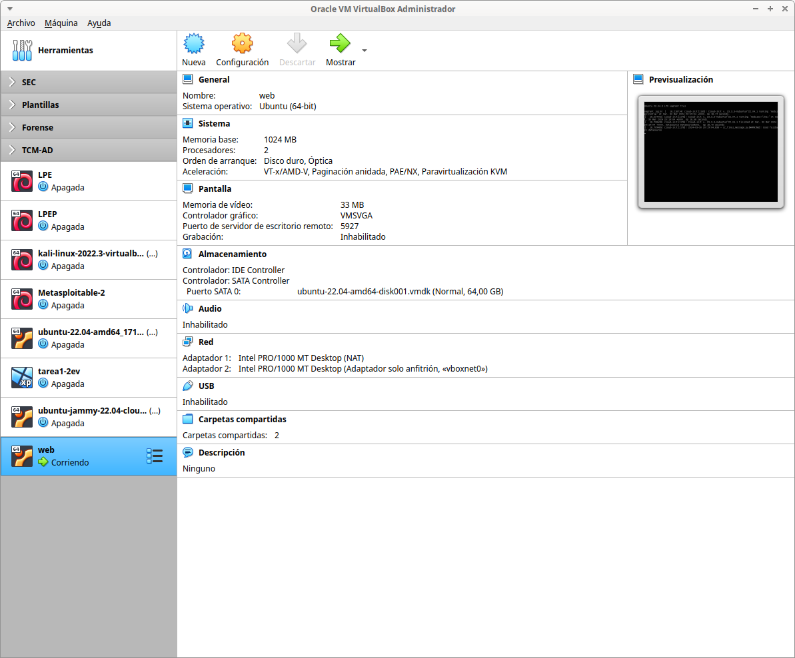

# Web

Infraestructura formada por un servidor web corriendo Apache con PHP. Tanto con Virtualbox como con incus/lxd, el proceso de instalación y configuración del servidor está automatizado y no requiere intervención manual de ningún tipo.

 Se trata de un infraestructura muy sencilla que puede tomarse como base para implementar otras más complejas.

- **web**:
  - Ubuntu 22.04 LTS.
  - servidor web con Apache+php.

## Virtualbox


- la interfaz de server está configurada en modo *host only* (solo anfitrión) usando la red 192.168.56.0/24.

### Archivos

- **Vagrantfile**: es posible personalizar la *box* usada, dirección IP de server, caracterísiticas de la máquina (RAM, cpu, gui visible o no, ...) y carpeta compartida entre la máquina server y el host anfitrión.
- **apache.sh**: script de aprovisionamiento para instalar y configurar el sistema:
  - permite configurar caché APT para acelerar el proceso de descarga de paquetes.
  - actualiza el sistema.
  - instala y configura paquetes (Apache, php, módulos php, net-tools, msql-client, ...).
  - habilita el sitio por defecto http/https y crea páginas index.php, info.php y descarga [Adminer](https://www.adminer.org/).


### Despliegue

```bash
$ mkdir www
$ vagrant validate
Vagrantfile validated successfully.
$ vagrant up
$ vagrant status
Current machine states:

default                   running (virtualbox)

The VM is running. To stop this VM, you can run `vagrant halt` to
shut it down forcefully, or you can run `vagrant suspend` to simply
suspend the virtual machine. In either case, to restart it again,
simply run `vagrant up`
```
[](https://asciinema.org/a/649919)




Para destruir la infraestructura:

```bash
$ vagrant destroy -f
==> default: Forcing shutdown of VM...
==> default: Destroying VM and associated drives.
```

## Incus /LXD


### Archivos

Similar para incus y lxd:

- **config_web_incus.yml**: fichero de *cloud-init* que permiten configurar el servidor de la organización:
  - nombre de equipo.
  - creación de un usuario adminsitrador *magasix*/*abc123.*
  - aplicar contraseña al usuario por defecto *ubuntu*/*abc123.*
  - permiten configurar caché APT para acelerar el proceso de descarga de paquetes.
  - actualización del equipo.
  - instalación del PPA Ondrej/php para poder instalar las versiones de PHP más recientes.
  - instalación y configuración de paquetes (Apache, php, MySQL client...):
    - habilitar sitio http/https y crear páginas index.php, info.php y descargar [Adminer](https://www.adminer.org/).
    - acceso por SSH mediante contraseña (recomendado habilitar clave pública).

### Despliegue

Similar para incus y lxd: el fichero de *cloud-init* permite el rápido despliegue de un servidor web. En caso de no indicar un *profile* se empleará el *profile* por defecto, por lo que el contenedor tendrá una NIC conectada a la red creada durante el proceso de inicialización de incus/lxd y un disco duro. La configuración de red la recibirá por DHCP.

**IMPORTANTE**:

- en caso de usar incus, hay que seleccionar las imágenes de tipo cloud al tener instalado *clout-init*.
- en caso de usar lxd, cualquiera de las imágenes Ubuntu oficiales ya tiene *cloud-init* instalado.

[](https://asciinema.org/a/649922)

```bash
$ incus launch images:ubuntu/22.04/cloud web -c user.user-data="$(cat config_web_incus.yml)"
Launching web
$ incus ls -c n,4,s,l,P,m
+------+---------------------+---------+----------------------+----------+--------------+
| NAME |        IPV4         |  STATE  |     LAST USED AT     | PROFILES | MEMORY USAGE |
+------+---------------------+---------+----------------------+----------+--------------+
| web  | 10.84.130.61 (eth0) | RUNNING | 2024/03/30 21:50 CET | default  | 179.74MiB    |
+------+---------------------+---------+----------------------+----------+--------------+
```

En caso de usar lxd:

```bash
$ lxc launch ubuntu:j web -c user.user-data="$(cat config_web_lxd.yml)"
Creating web
Starting web
$ lxc ls -c n,4,s,l,P,m
+------+---------------------+---------+----------------------+----------+--------------+
| NAME |        IPV4         |  STATE  |     LAST USED AT     | PROFILES | MEMORY USAGE |
+------+---------------------+---------+----------------------+----------+--------------+
| web  | 10.79.128.23 (eth0) | RUNNING | 2024/03/30 21:00 UTC | default  | 243.03MiB    |
+------+---------------------+---------+----------------------+----------+--------------+
```

Una vez terminado el despliegue, hay que esperar unos minutos hasta que termine el aprovisionamiento del contenedor (instalación de software y configuración del equipo). Se puede comprobar si ha terminado el proceso por ejemplo verificando que los servicios web y ssh corriendo en web están levantados:

```bash
$ incus exec web -- ss -ltn | grep -E "80|443|22"
LISTEN 0      128          0.0.0.0:22        0.0.0.0:*          
LISTEN 0      511                *:443             *:*          
LISTEN 0      128             [::]:22           [::]:*          
LISTEN 0      511                *:80              *:* 
```

O si *cloud-init* ha finalizado:

```bash
$ incus exec web -- tail /var/log/cloud-init-output.log
   200K .......... .......... .......... .......... .......... 53% 1.48M 0s
   250K .......... .......... .......... .......... .......... 64% 18.9M 0s
   300K .......... .......... .......... .......... .......... 75% 15.9M 0s
   350K .......... .......... .......... .......... .......... 85% 27.8M 0s
   400K .......... .......... .......... .......... .......... 96% 1.02M 0s
   450K .......... .....                                      100% 21.4M=0.3s

2024-03-30 21:51:43 (1.56 MB/s) - ‘/var/www/html/adminer.php’ saved [476603/476603]

Cloud-init v. 23.4.4-0ubuntu0~22.04.1 finished at Sat, 30 Mar 2024 20:51:43 +0000. Datasource DataSourceNoCloud [seed=/var/lib/cloud/seed/nocloud-net][dsmode=net].  Up 67.50 seconds
```

En caso de querer eliminar el contenedor se procede con:

```bash
$ incus delete -f web 
$ incus ls -c n,4,s,l,P,m
+------+------+-------+--------------+----------+--------------+
| NAME | IPV4 | STATE | LAST USED AT | PROFILES | MEMORY USAGE |
+------+------+-------+--------------+----------+--------------+
```

```bash
$ lxc delete -f web 
$ lxc ls -c n,4,s,l,P,m
+------+------+-------+--------------+----------+--------------+
| NAME | IPV4 | STATE | LAST USED AT | PROFILES | MEMORY USAGE |
+------+------+-------+--------------+----------+--------------+
```

