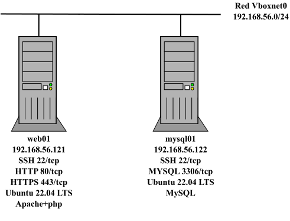
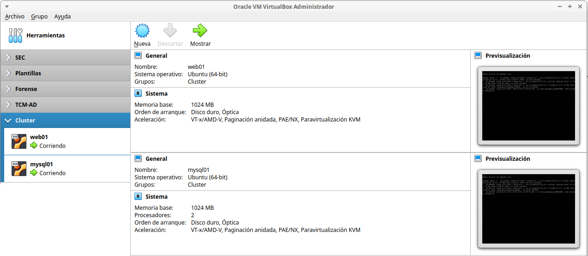
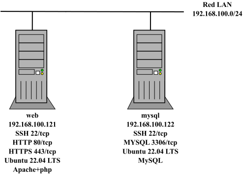

# Web-DB

Infraestructura formada por un servidor web y un servidor de base de datos:

- **Web**:
  - Ubuntu 22.04 LTS.
  - Apache con soporte para PHP y varios módulos PHP instalados (php-mbstring, php-xmlrpc, php-soap, php-gd, php-xml, php-intl, php-mysql, php-cli, php-zip, php-curl, ...).
  - Cliente MySQL y [Adminer](https://www.adminer.org/) para gestionar el servidor MySQL.
  - Página web básica index.php e info.php.
- **MySQL**:
  - Ubuntu 22.04 LTS.
  - Servidor y cliente MySQL.
  - Creada una base de datos llamada *wordpress* y autorizado el acceso al usuario *wordpress/Abc123..* desde el equipo Web.

## Virtualbox



### Archivos

- **Vagrantfile**: es posible personalizar las *boxes* usadas, direcciones IP de las máquinas, los puertos para *port forwarding* y caracterísiticas de las máquinas (RAM, cpu, gui visible o no, ...) y carpeta compartida entre la máquina web01 y el host anfitrión.
- **apache.sh**: script de aprovisionamiento para instalar y configurar el servidor web.
- **mysql.sh**:  script de aprovisionamiento para instalar y configurar el servidor MySQL.

En los scripts de aprovisionamiento es posible definir una caché APT para acelerar el proceso de descarga de paquetes acelerando el proceso de instalación.

### Despliegue

```bash
$ mkdir www
$ vagrant validate
Vagrantfile validated successfully.
$ vagrant up
$ vagrant status
Current machine states:

web01                     running (virtualbox)
mysql01                   running (virtualbox)

This environment represents multiple VMs. The VMs are all listed
above with their current state. For more information about a specific
VM, run `vagrant status NAME`.
```
[](https://asciinema.org/a/2m9w73siz2FFG5oAimg6Cdiez)



Para destruir la infraestructura:

```bash
$ vagrant destroy -f
==> mysql01: Forcing shutdown of VM...
==> mysql01: Destroying VM and associated drives...
==> web01: Forcing shutdown of VM...
==> web01: Destroying VM and associated drives...
```

## Incus /LXD



### Archivos

Similar para incus y lxd:

- **escenario_cluster_web_bd_incus.sh**: script de despliegue de la infraestructura donde se puede controlar:
  - creación de la red LAN (nombre, dirección de red, rango de IPs asignadas por DHCP, ...).
  - creación *profile* LAN.
  - personalización de las direcciones IPs de los contenedores web y mysql.
- **config_web_incus.yml** y **config_mysql_incus_PLANTILLA.yml**: fichero de *cloud-init* que permiten configurar web y mysql.
  - nombre de equipo.
  - creación de un usuario adminsitrador *magasix*/abc123.
  - aplicar contraseña al usuario por defecto *ubuntu*/*abc123.*
  - permiten configurar caché APT para acelerar el proceso de descarga de paquetes.
  - instalación y configuración de paquetes (Apache, php, MySQL, ...):
    - habilitar sitio http/https y crear páginas index.php, info.php y descargar [Adminer](https://www.adminer.org/).
    - creación base de datos *wordpress* y autorización a usuario *wordpress/ABC123..* para acceder desde web, ...
    - acceso por SSH mediante contraseña (recomendado habilitar clave pública).
- **profile_LAN**: plantilla para crear profile LAN (una NIC conectada a la red LAN y una unidad de disco).
- **network_PLANTILLA.yml**: plantilla para personalizar la configuración de red de los contenedores

### Despliegue

Similar para incus y lxd: asignar permisos de ejecución al script y escoger la opción 1. 

[](https://asciinema.org/a/x1ffmwPMVyAGcFd0EQ2pipjjg)

```bash
$ chmod 755 escenario_cluster_web_bd_incus.sh
$ ./escenario_cluster_web_bd_incus.sh
----- Escenario Cluster Web-BD -----
Seleccionar operación:
1. Crear escenario
2. Parar contenedores escenario
3. Arrancar contenedores escenario
4. Borrar escenario
------
1
Crear escenario
Network lan created
Perfil LAN creado
------------------------------
     creando web server       
------------------------------
Launching web
------------------------------
     creando myslq server     
------------------------------
Launching mysql
 
+-------+---------+------------------------+----------+-----------+----------------------+
| NAME  |  STATE  |          IPV4          | PROFILES | SNAPSHOTS |     LAST USED AT     |
+-------+---------+------------------------+----------+-----------+----------------------+
| mysql | RUNNING | 192.168.100.122 (eth0) | LAN      | 0         | 2024/03/29 12:43 CET |
+-------+---------+------------------------+----------+-----------+----------------------+
| web   | RUNNING | 192.168.100.121 (eth0) | LAN      | 0         | 2024/03/29 12:43 CET |
+-------+---------+------------------------+----------+-----------+----------------------+
```

Una vez terminado el despliegue, hay que esperar unos minutos hasta que termine el aprovisionamiento de los contenedores (instalación de software y configuración del equipo). Se puede comprobar si ha terminado el proceso comprobando si los servicios están levantados ejecutando:

```bash
$ incus exec web -- ss -ltn
State            Recv-Q            Send-Q            Local Address:Port            Peer Address:Port            Process
LISTEN           0                 128                     0.0.0.0:22                   0.0.0.0:*
LISTEN           0                 4096              127.0.0.53%lo:53                   0.0.0.0:*
LISTEN           0                 511                           *:80                         *:*                       
LISTEN           0                 128                        [::]:22                      [::]:*
LISTEN           0                 511                           *:443                        *:*                       
$ incus exec mysql -- ss -ltn
State            Recv-Q            Send-Q            Local Address:Port            Peer Address:Port            Process
LISTEN           0                 151                     0.0.0.0:3306                 0.0.0.0:*
LISTEN           0                 70                     127.0.0.1:33060               0.0.0.0:*
LISTEN           0                 128                      0.0.0.0:22                  0.0.0.0:*
LISTEN           0                 4096               127.0.0.53%lo:53                  0.0.0.0:*
LISTEN           0                 128                         [::]:22                     [::]:* 
```

O si cloud-init ha finalizado:

```bash
$ incus exec web -- tail /var/log/cloud-init-output.log
   200K .......... .......... .......... .......... .......... 53% 1.02M 0s
   250K .......... .......... .......... .......... .......... 64% 15.8M 0s
   300K .......... .......... .......... .......... .......... 75% 79.5M 0s
   350K .......... .......... .......... .......... .......... 85% 63.7M 0s
   400K .......... .......... .......... .......... .......... 96%  956K 0s
   450K .......... .....                                      100% 9.13M=0.3s

2024-03-29 12:44:47 (1.57 MB/s) - ‘/var/www/html/adminer.php’ saved [476603/476603]

Cloud-init v. 23.4.4-0ubuntu0~22.04.1 finished at Fri, 29 Mar 2024 11:44:47 +0000. Datasource DataSourceNoCloud [seed=/var/lib/cloud/seed/nocloud-net][dsmode=net].  Up 80.88 seconds

$ incus exec mysql -- tail /var/log/cloud-init-output.log
Setting up libhttp-message-perl (6.36-1) ...
Setting up mysql-server (8.0.36-0ubuntu0.22.04.1) ...
Setting up libcgi-pm-perl (4.54-1) ...
Setting up libhtml-template-perl (2.97-1.1) ...
Setting up libcgi-fast-perl (1:2.15-1) ...
Processing triggers for libc-bin (2.35-0ubuntu3.6) ...
mysql: [Warning] Using a password on the command line interface can be insecure.
mysql: [Warning] Using a password on the command line interface can be insecure.
mysql: [Warning] Using a password on the command line interface can be insecure.
Cloud-init v. 23.4.4-0ubuntu0~22.04.1 finished at Fri, 29 Mar 2024 11:44:52 +0000. Datasource DataSourceNoCloud [seed=/var/lib/cloud/seed/nocloud-net][dsmode=net].  Up 83.75 seconds
```

Las opciones 2 y 3 permiten apagar y arrancar los contenedores respectivamente, y la opción 4 borra los contenedores pero no la red LAN ni el profile LAN por si se necesitan para otros escenarios.
